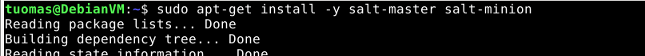

Course material: https://terokarvinen.com/2022/palvelinten-hallinta-2022p2/

Environment: VirtualBox VM running Debian 11 XFCE. VM has 4 GB of RAM and 40 GB of disk space.

---

## Read and summarise.

**Objective: Read the provided material and summarise with a few points.**

- Karvinen 2020: [Command Line Basics Revisited](http://terokarvinen.com/2020/command-line-basics-revisited/)
- Karvinen 2018: [Salt States – I Want My Computers Like This](http://terokarvinen.com/2018/salt-states-i-want-my-computers-like-this)
- Karvinen 2006: [Raportin kirjoittaminen](https://terokarvinen.com/2006/raportin-kirjoittaminen-4/?fromSearch=raportin%20kirjoittaminen)

Coming soon.

---

## Salt file creation

**Objective: Create a file using a Salt command (state.single).**

I started by updating packages and installing salt-master and salt-minion.

    $ sudo apt-get update   
    $ sudo apt-get install -y salt-master salt-minion

