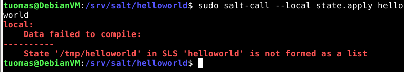

This is the first week of the Configuration Management Systems course at Haaga-Helia University of Applied Sciences. The course lasts for the next 2.5 months until the end of 2022. This week we learned the basic concepts master-minion architecture, Salt fundamentals, remote code execution, and infrastructure as code.

Course material: https://terokarvinen.com/2022/palvelinten-hallinta-2022p2/

Environment: VirtualBox VM running Debian 11 XFCE. VM has 4 GB of RAM and 40 GB of disk space.

---

## Read and summarise.

**Objective: Read the provided material and summarise with a few points.**

Karvinen 2020: [Command Line Basics Revisited](http://terokarvinen.com/2020/command-line-basics-revisited/)

- Many commands have built-in help e.g *ls --help*. The manual -- *man* -- isn't the only place to read documention.

Karvinen 2018: [Salt States – I Want My Computers Like This](http://terokarvinen.com/2018/salt-states-i-want-my-computers-like-this)

- Master instructions are stored in /srv/salt.
- Use state.apply to run the instruction file.
- Create a top.sls file which runs automatically every 30 minutes.

Karvinen 2006: [Raportin kirjoittaminen](https://terokarvinen.com/2006/raportin-kirjoittaminen-4/?fromSearch=raportin%20kirjoittaminen)

- A report is a good way to debug
- If you give your report to someone else they have to be able to replicate all actions using the report.
- List your sources.

---

## Salt file creation

**Objective: Create a file using a Salt command (state.single).**

I started by updating packages and installing salt-master and salt-minion.

    $ sudo apt-get update   
    $ sudo apt-get install -y salt-master salt-minion


I constructed the command from what I remembered from the example shown in class.

    $ sudo salt --local state.single file.managed /tmp/foobar.txt
    Usage: salt [options] '<target>' <function> [arguments]

    salt: error: no such option: --local


First I thought the *--local* target was wrong because the error message mentioned it. I looked up my notes and spotted my actual error which was using *salt* and not *salt-call*. I fixed the command and ran it again. This time it went through.

    $ sudo salt-call --local state.single file.managed /tmp/foobar.txt


I double-checked that *foobar.txt* was actually created to /tmp/.


---

## Creating a idempotent Hello World as infrastructure code

I created a directory to house the Hello World code.

    $ cd /srv
    $ sudo mkdir salt/helloworld
    mkdir: cannot create directory ‘salt/helloworld’: No such file or directory


Oops, I forgot sudo.

    $ sudo mkdir -p  salt/helloworld

I created the *init.sls* YAML file which will contain the code.

    $ cd /salt/helloworld
    $ sudoedit init.sls
    $ cat init.sls
    /tmp/helloworld:
      file.managed:
        contents: "Hello World"

I ran the command to run the code but it returned with an error message.

    $ sudo salt-call --local state.apply helloworld
    local:
        Data failed to compile:
    ----------
        State '/tmp/helloworld' in SLS 'helloworld' is not formed as a list



I made a mistake in the code. The third line should start with a dash because it's supposed to be a list. I went and fixed my mistake and ran the command again.

    $ sudoedit init.sls
    $ cat init.sls
    /tmp/helloworld:
      file.managed:
        - contents: "Hello World"

    $ sudo salt-call --local state.apply helloworld


I again double-checked that the file was created properly.


---

## Collect system information using Salt

**Objective: Collect information about the system using Salt and the *grains.items* state function**

I used the grains.items state function. I got back a long list of information.

    $ sudo salt-call --local grains.items


I did and additional call to get specific information.

    $ sudo salt-call --local grains.item osfullname osrelease


---

## Creating a new user and group using Salt

**Objective: Try out state functions other than file.managed. Important ones are pkg.installed, file.managed, service.running, file.symlink, user.present, group.present. For help: *"sudo salt-call --local sys.state_doc pkg.installed|less"***

I wanted to try the *user.present* and *group.present* state functions to create a new user and a new group to which to add the new user to.

I started by creating a new directory to */srv/salt/*.

    $ sudo mkdir createtestuser
    $ sudoedit createtestuser/init.sls

I wrote the init file using the information I found from *state_doc*.

```
salt-test-user:
  user.present:
  	- fullname: Salt test user - Tuomas Valkamo
  	- password: $5$S5ZMYPuSpqukbmKB$90MzKLG/HBwUPTjCrdD83HGPeKacvOe8E13zIpOfYNA
  	- createhome: False

salt-test-group:
  group.present:
    - addusers:
      - salt-test-user
```

The documentation recommended generating a hash for the user password using *mkpasswd -m sha-256*, so that's what I did. I set *createhome* to be *False* so that there would be no */home* directory created.

Regarding the user and group name, I chose to include the names as the state ID because that is what the example in the *state_doc* did. There was a *name* argument that could be set but I left it out.

I ran the file to see what would happen.

```
$ sudo salt-call --local state.apply createtestuser
[CRITICAL] Rendering SLS 'base:createtestuser' failed: found character that cannot start any token
local:
    Data failed to compile:
----------
    Rendering SLS 'base:createtestuser' failed: found character that cannot start any token
```


Unsuprisingly something went wrong. My first thought was to add double quotes around the String values *fullname* and *password*.

```
salt-test-user:
  user.present:
  	- fullname: "Salt test user - Tuomas Valkamo"
  	- password: "$5$S5ZMYPuSpqukbmKB$90MzKLG/HBwUPTjCrdD83HGPeKacvOe8E13zIpOfYNA"
  	- createhome: False

salt-test-group:
  group.present:
    - addusers:
      - salt-test-user
```

I ran the *state.apply* command again but the same error persisted.

I googled the error message and found a [Stack Overflow answer](https://stackoverflow.com/questions/19356278/im-getting-found-character-that-cannot-start-any-token-while-scanning-for-the) that diagnosed the issue to be the use a tab indentation instead of spaces somewhere. Unfortunately in the editor I'm using (micro) there is no way of seeing the difference between the two. 

I went though all the lines and deleted the indentations and replaced them with spaces. The problem spot turned out to be the list under *user.present*. I'm just glad my file wasn't longer than the ten lines I had.

Finally I ran the *state.apply* command again. This time it worked.

    $ sudo salt-call --local state.apply createtestuser


I checked that the user was created by reading */etc/passwd* file.

    $ cat /etc/passwd


The salt-test-user seemed to have a home directory even though I specified it to not have one. I checked the */home* directory see if it was there.

    $ cd /home
    $ ls -al

 

Thankfully nothing was there. Weird that */etc/passwd* showed */home/salt-test-user*.

I also checked that the new group was created

    $ groups salt-test-user

