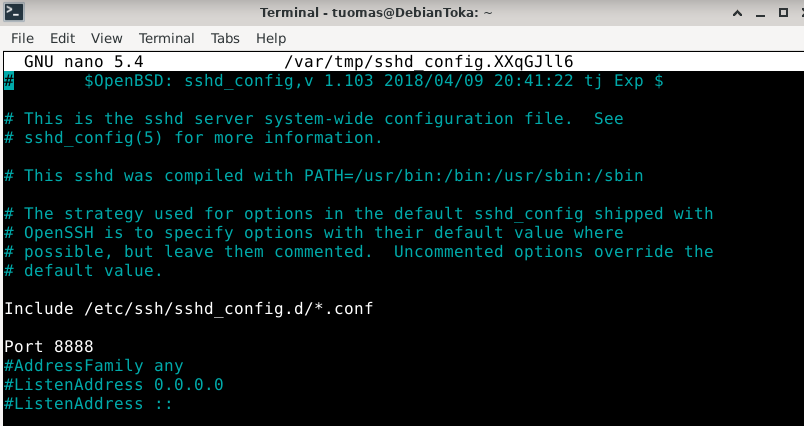
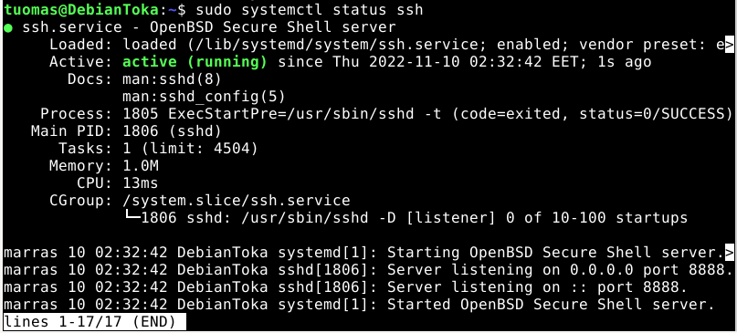
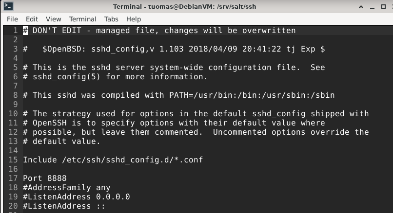
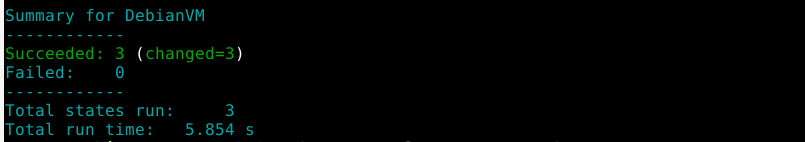
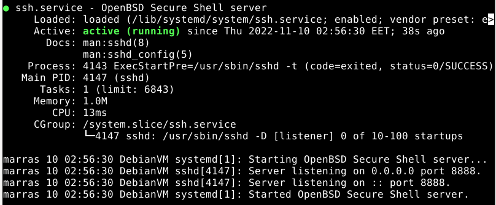
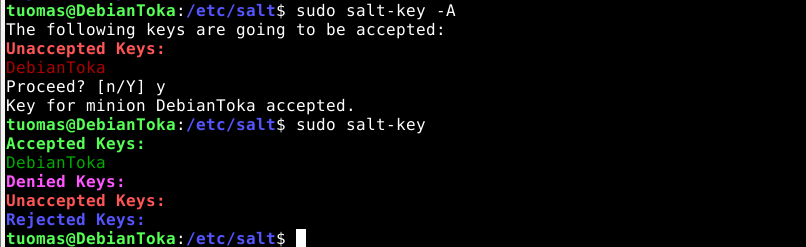

Course material: https://terokarvinen.com/2022/palvelinten-hallinta-2022p2/

Environment: VirtualBox VM running Debian 11 XFCE. VM has 4 GB of RAM and 40 GB of disk space.

--- 

## Read and summarize

[Karvinen 2018: Salt Quickstart - Salt Stack Master and Slave on Ubuntu Linux](http://terokarvinen.com/2018/salt-quickstart-salt-stack-master-and-slave-on-ubuntu-linux)

- Slave configuration file is located in /etc/salt/minion
- Restart salt-minion.service after changes to configuration file
- Accept slaves with `salt-key`

[Salt official documentation: Salt Getting Started Guide, chapters: Understanding SaltStack, SaltStack Fundamentals, and SaltStack Configuration Management: Functions](https://docs.saltproject.io/en/getstarted/)

- Use Salt to manage thousands of machines at the same time
- The default Salt subsystems can be changed to many different plug-ins
- Salt state functions provide the functionality you need in most cases

---

## Daemon configuration

**Objective: Configure a daemon using the package-file-service structure. Do the install first manually and then using automation.**

I decided to configure SSH to a minion machine. I started by doing the installation manually to document all the different stages.

### Manual test

I installed openssh-server.

    $ sudo apt-get update
    $ sudo apt-get install -y openssh-server

I changed the SSH port to 8888.

    $ sudoedit /etc/ssh/sshd_config



I restarted the SSH service.

    $ sudo systemctl restart ssh



### Automating daemon install

I created a new directory called ssh to /srv/salt/ssh.

    $ sudo mkdir /srv/salt/ssh

Inside the directory, I created init.sls.

    $ cd ssh/
    $ sudoedit init.sls
    $ cat init.sls

    openssh-server:
      pkg.installed

    /etc/ssh/sshd_config:
      file.managed:
        - source: "salt://ssh/sshd_config"

    ssh.service:
      service.running:
        - watch:
          - file: /etc/ssh/sshd_config

I created a file called sshd_config. I used the default sshd_config file but changed the port to 8888.

    $ sudoedit sshd_config



I ran the salt configuration on the minion.

    $ sudo salt '*' state.apply ssh

All the actions were completed.



I checked SSH service status to double-check that it was running.

    $ sudo systemctl status ssh



---

## Salt master and minion on the same machine

**Objective: Install Salt master and minion to the same machine**

I installed the packages for master and minion.

    $ sudo apt-get -y install salt-master salt-minion

I checked my hostname.

    $ hostname -I
    10.0.2.15 192.168.11.5

I edited the minion configuration file.

    $ sudoedit /etc/salt/minion

    master: 10.0.2.15

I restarted the minion service.

    $ sudo systemctl restart salt-minion

I started salt-master service.

    $ sudo systemctl start salt-master

I accepted the minion using `salt-key`.

    $ sudo salt-key -A



---

## Analyzing debug output

**Objective: Run a Salt state locally without the master-slave architecture. Analyze the debug output. (`sudo salt-call --local state.apply hellotero -l debug`)**

I ran a helloworld state.

    $ sudo salt-call --local state.apply helloworld -l debug

```
[DEBUG   ] Reading configuration from /etc/salt/minion
[DEBUG   ] Including configuration from '/etc/salt/minion.d/_schedule.conf'
[DEBUG   ] Reading configuration from /etc/salt/minion.d/_schedule.conf
[DEBUG   ] Using cached minion ID from /etc/salt/minion_id: DebianVM
[DEBUG   ] Configuration file path: /etc/salt/minion
[WARNING ] Insecure logging configuration detected! Sensitive data may be logged.
[DEBUG   ] Grains refresh requested. Refreshing grains.
[DEBUG   ] Reading configuration from /etc/salt/minion
[DEBUG   ] Including configuration from '/etc/salt/minion.d/_schedule.conf'
[DEBUG   ] Reading configuration from /etc/salt/minion.d/_schedule.conf
[DEBUG   ] Elapsed time getting FQDNs: 0.014844894409179688 seconds
[DEBUG   ] LazyLoaded zfs.is_supported
[DEBUG   ] Determining pillar cache
[DEBUG   ] LazyLoaded jinja.render
[DEBUG   ] LazyLoaded yaml.render
[DEBUG   ] LazyLoaded jinja.render
[DEBUG   ] LazyLoaded yaml.render
[DEBUG   ] LazyLoaded state.apply
[DEBUG   ] LazyLoaded direct_call.execute
[DEBUG   ] LazyLoaded saltutil.is_running
[DEBUG   ] LazyLoaded grains.get
[DEBUG   ] LazyLoaded config.get
[DEBUG   ] LazyLoaded roots.envs
[DEBUG   ] Could not LazyLoad roots.init: 'roots.init' is not available.
[DEBUG   ] Updating roots fileserver cache
[DEBUG   ] Gathering pillar data for state run
[DEBUG   ] Determining pillar cache
[DEBUG   ] LazyLoaded jinja.render
[DEBUG   ] LazyLoaded yaml.render
[DEBUG   ] Finished gathering pillar data for state run
[INFO    ] Loading fresh modules for state activity
[DEBUG   ] LazyLoaded jinja.render
[DEBUG   ] LazyLoaded yaml.render
[DEBUG   ] Could not find file 'salt://helloworld.sls' in saltenv 'base'
[DEBUG   ] In saltenv 'base', looking at rel_path 'helloworld/init.sls' to resolve 'salt://helloworld/init.sls'
[DEBUG   ] In saltenv 'base', ** considering ** path '/var/cache/salt/minion/files/base/helloworld/init.sls' to resolve 'salt://helloworld/init.sls'
[DEBUG   ] compile template: /var/cache/salt/minion/files/base/helloworld/init.sls
[DEBUG   ] Jinja search path: ['/var/cache/salt/minion/files/base']
[DEBUG   ] LazyLoaded roots.envs
[DEBUG   ] Could not LazyLoad roots.init: 'roots.init' is not available.
[PROFILE ] Time (in seconds) to render '/var/cache/salt/minion/files/base/helloworld/init.sls' using 'jinja' renderer: 0.017128467559814453
[DEBUG   ] Rendered data from file: /var/cache/salt/minion/files/base/helloworld/init.sls:
/tmp/helloworld:
  file.managed:
    - contents: "Hello World"

[DEBUG   ] Results of YAML rendering: 
OrderedDict([('/tmp/helloworld', OrderedDict([('file.managed', [OrderedDict([('contents', 'Hello World')])])]))])
[PROFILE ] Time (in seconds) to render '/var/cache/salt/minion/files/base/helloworld/init.sls' using 'yaml' renderer: 0.0002377033233642578
[DEBUG   ] LazyLoaded config.option
[DEBUG   ] LazyLoaded file.managed
[INFO    ] Running state [/tmp/helloworld] at time 03:17:57.015876
[INFO    ] Executing state file.managed for [/tmp/helloworld]
[DEBUG   ] LazyLoaded file.source_list
[INFO    ] File changed:
New file
[INFO    ] Completed state [/tmp/helloworld] at time 03:17:57.022240 (duration_in_ms=6.364)
[DEBUG   ] File /var/cache/salt/minion/accumulator/139852177273760 does not exist, no need to cleanup
[DEBUG   ] LazyLoaded state.check_result
[DEBUG   ] LazyLoaded highstate.output
[DEBUG   ] LazyLoaded nested.output
local:
----------
          ID: /tmp/helloworld
    Function: file.managed
      Result: True
     Comment: File /tmp/helloworld updated
     Started: 03:17:57.015876
    Duration: 6.364 ms
     Changes:   
              ----------
              diff:
                  New file

Summary for local
------------
Succeeded: 1 (changed=1)
Failed:    0
------------
Total states run:     1
Total run time:   6.364 ms
```

Salt reads the minion configuration files. It then loads at least some of the Salt subsystems. Before the state run is executed, Salt gathers pillar data for it, which is usually configuration data such as ports, file paths, or configuration parameters. After gathering pillar data, Salt tries to find the file helloworld/init.sls. It then renders the data inside the file and executes all the state functions called in the file.

---

## Sources

Tero Karvinen:

- https://terokarvinen.com/2018/pkg-file-service-control-daemons-with-salt-change-ssh-server-port/?fromSearch=salt%20daemons
- https://terokarvinen.com/2018/salt-quickstart-salt-stack-master-and-slave-on-ubuntu-linux/
- https://terokarvinen.com/2022/palvelinten-hallinta-2022p2/