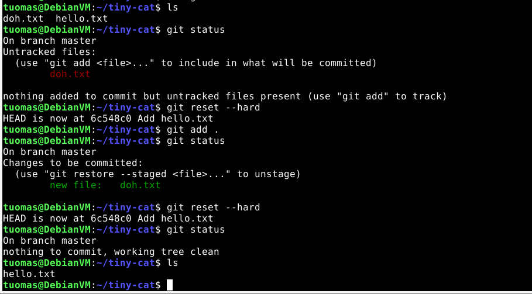
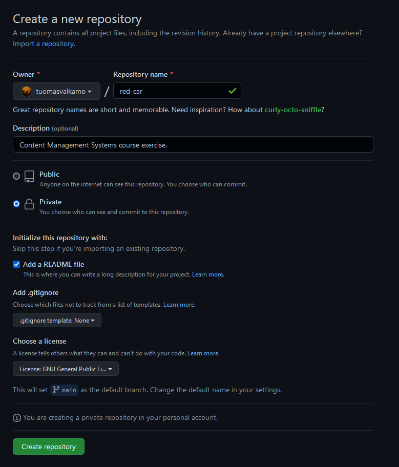
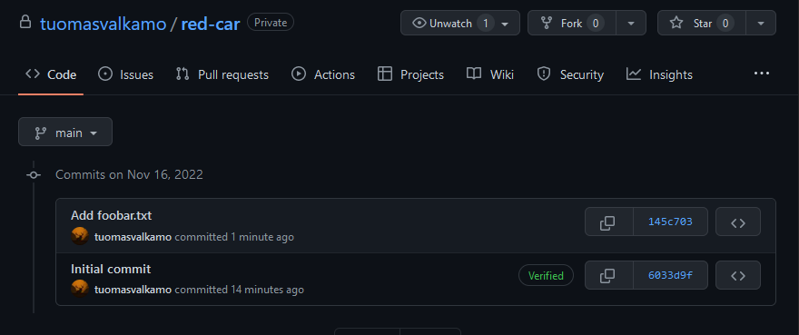

Course material: https://terokarvinen.com/2022/palvelinten-hallinta-2022p2/

Environment: VirtualBox VM running Debian 11 XFCE. VM has 4 GB of RAM and 40 GB of disk space.

---

## Markdown

**Objective: Write this post using Markdown language.**

All of my posts are written in Markdown. [Source code](https://github.com/tuomasvalkamo/tuomasvalkamo-com/blob/main/content/blog/CMS-course/week-3/index.md) for this post.

---

## Offline

**Objective: Create a local git repository. Repository name must include the word *cat*. Set your git name and email. Demonstrate making changes to your repository and viewing git logs.**

I created a new folder called *tiny-cat*.

    $ mkdir tiny-cat

I moved into the new folder and initialized a new git repository.

    $ cd tiny-cat
    $ git init

I set my git name and email. ([Setting your username in git](https://docs.github.com/en/get-started/getting-started-with-git/setting-your-username-in-git))

    $ git config --global user.name
    Tuomas Valkamo
    $ git config --global user.email
    ____@gmail.com

I created a called hello.txt and committed it to my repository.

    $ touch hello.txt
    $ git add .
    $ git commit -m "Add hello.txt"

The -m flag lets me write the commit message in the same command.

I checked the git log. It showed the commit I made.

    $ git log

---

## Doh!

**Objective: Make a dumb change to git, do not commit. Erase unwanted changes with `git reset --hard`. Note that this operation can't be undone.**

I created a new file called doh.txt.

    $ touch doh.txt

I ran the `git reset` command but the file wasn't deleted from the project directory.

    $ git reset --hard

After reading the documentation I realized that the changes have to be added to the git index (source: man git-reset, man git-add). Only after that can the changes be reset.

    $ git add .
    $ git reset --hard

---

## Online

**Objective: Create a repository to GitHub. The name must include the word *car*.**

I created a new repository called *red-car*. I added a README.md, and LICENCE (GNU GPL v3) files.

---

## Dolly

**Objective: Clone your repo from GitHub to your machine. Make changes and push them to GitHub. Show the changes in the web interface.**

I cloned the project to my user directory using SSH.

    $ cd
    $ git clone git@github.com:tuomasvalkamo/red-car.git

**Written from memory since I had already done this step:**

I generated a new SSH key.

    $ ssh-keygen

I copied my SSH public key from /home/tuomas/.ssh/id_rsa.pub. I added a new SSH key to GitHub in https://github.com/settings/keys and pasted my public key there.

**Continuing from here:**

Inside the *red-car* repository, I created a new file called foobar.txt, added it to index, committed it, pulled the most recent version, and pushed the changes to GitHub.

    $ touch foobar.txt
    $ git add .
    $ git commit -m "Add foobar.txt"
    $ git pull
    $ git push

## Sources

- Tero Karvinen, https://terokarvinen.com/2022/palvelinten-hallinta-2022p2/
- GitHub, https://docs.github.com/en/get-started/getting-started-with-git/setting-your-username-in-git
- man git-reset
- man git-add