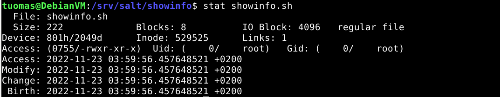

Course material: https://terokarvinen.com/2022/palvelinten-hallinta-2022p2/

Environment: VirtualBox VM running Debian 11 XFCE. VM has 4 GB of RAM and 40 GB of disk space.

---

## a) Hello command!

**Objective: Make a "Hello World" script available to the system and install it on all Salt minions. Include in your report the minions 'ls -l /usr/local/bin/'.**

I started by running the command without a script.

    $ echo "Hello World"
    Hello World

I created a file called helloworld.sh to ~/scripts.

    $ micro helloworld.sh
    $ cat helloworld.sh
    #! /usr/bin/bash

    echo "Hello World"

I then copied the file to /usr/local/bin and tested it by typing `helloworld.sh`.


I created a new project directory under /srv/salt/

    $ sudo mkdir helloshell

I went to copy the script there and I noticed that I forgot to set execute permissions on the file. I fixed it and copied the script over.

    $ cd ~/scripts
    $ sudo chmod ugo+x helloworld.sh
    $ sudo cp helloworld.sh /srv/salt/helloshell/

I created an init.sls file. I checked helloworld.sh with the `stat` command to get its numeric permission information.

    $ cd /srv/salt/helloshell
    $ sudoedit init.sls
    $ stat helloworld.sh


I then edited init.sls.

    $ sudoedit init.sls
    $ cat init.sls
    /usr/local/bin/helloworld.sh:
      file.managed:
        - source: salt://helloshell/helloworld.sh
        - mode: 755

Because I have the salt minion installed locally on the same machine, I deleted the helloworld.sh script from /usr/local/bin before running the Salt code.

    $ sudo rm /usr/local/bin/helloworld.sh

I added a test to the init.sls file.

    $ cat init.sls
    /usr/local/bin/helloworld.sh:
      file.managed:
        - source: salt://helloshell/helloworld.sh
        - mode: 755

    # Test
    'ls -l /usr/local/bin/':
      cmd.run

I ran `salt-call`. The command worked and the `ls` line showed the right permissions.

    $ sudo salt-call --local state.apply helloshell


---

## b) Whatsup.sh

**Objective: Make a script available to the system that outputs current information. Install it to all Salt minions. Tips: You can show date, weather, system, network or other data.**

### Creating the script

I tested some commands I found through Google searches (sources: [Tecmint](https://www.tecmint.com/commands-to-collect-system-and-hardware-information-in-linux/), [Ostechnix](https://ostechnix.com/check-weather-details-command-line-linux/), [Wrrt.in](https://github.com/chubin/wttr.in), [Cyberciti](https://www.cyberciti.biz/faq/linux-list-network-interfaces-names-command/)):

    # Show date & time
    $ date

    # Show system info
    $ uname -a

    # Show weather info
    $ curl wttr.in/Helsinki?format=4

    # Show network info. Needs tcpdump installed.
    $ tcpdump --list-interfaces

I created a file called showinfo.sh to ~/scripts.

    $ cd ~/scripts
    $ micro showinfo.sh

I gave execute permissions to all users.

    $ sudo chmod ugo+x showinfo.sh

I added all the commands to the script, testing the functionality before adding the next one by running `bash showinfo.sh`.

```
$ cat showinfo.sh
#! /usr/bin/bash

echo "DATE AND TIME:" &&  date
echo " "

echo "SYSTEM INFO:" && uname -a
echo " "

echo "WEATHER INFO:" && curl wttr.in/Helsinki?format=4
echo " "

echo "NETWORK INTERFACES:" && tcpdump --list-interfaces
```

(Source used: [Preferred method to echo a blank line](https://stackoverflow.com/questions/37052899/what-is-the-preferred-method-to-echo-a-blank-line-in-a-shell-script))

I ran the script.

    $ bash showinfo.sh

    DATE AND TIME:
    ke 23.11.2022 03.54.14 +0200
    
    SYSTEM INFO:
    Linux DebianVM 5.10.0-19-amd64 #1 SMP Debian 5.10.149-2 (2022-10-21) x86_64 GNU/Linux
    
    WEATHER INFO:
    Helsinki: ⛅️  🌡️-3°C 🌬️↓11km/h
    
    NETWORK INTERFACES:
    1.enp0s3 [Up, Running, Connected]
    2.enp0s8 [Up, Running, Connected]
    3.any (Pseudo-device that captures on all interfaces) [Up, Running]
    4.lo [Up, Running, Loopback]
    5.bluetooth-monitor (Bluetooth Linux Monitor) [Wireless]
    6.nflog (Linux netfilter log (NFLOG) interface) [none]
    7.nfqueue (Linux netfilter queue (NFQUEUE) interface) [none]
    8.dbus-system (D-Bus system bus) [none]
    9.dbus-session (D-Bus session bus) [none]


### Creating Salt file

I created a new project directory under /srv/salt/.

    $ sudo mkdir showinfo
    $ cd showinfo/

I copied the script to the Salt project.

    $ sudo cp ~/scripts/showinfo.sh .

I checked the right numerical permission. I saw that it was 755.

    $ stat showinfo.sh



I created the init.sls file.

    $ sudoedit init.sls
    $ cat init.sls
    tcpdump:
      pkg.installed

    /usr/local/bin/:
      file.managed:
        - source: salt://showinfo/showinfo.sh
        - mode: 755

    # Test
    'ls -l /usr/local/bin/':
      cmd.run

I ran the Salt file with salt-call but there was an error with creating the script file. I typed the file location wrong.

    $ sudo salt-call --local state.apply showinfo

```
          ID: /usr/local/bin/
    Function: file.managed
      Result: False
     Comment: Specified target /usr/local/bin/ is a directory
     Started: 04:08:00.711920
    Duration: 2.367 ms
     Changes: 
```


I fixed the code.

    # Old
    /usr/local/bin/:
    # New 
    /usr/local/bin/showinfo.sh:

I ran the command again. Now it worked.

    $ sudo salt-call --local state.apply showinfo


---

## c) Hello.py

**Objective: Create a script using Python and make it available to the system. Install it on Salt minions. A "Hello World" is sufficient. As Shebang use "#!/usr/bin/python3".**

I created a new script called hellotest.py to ~/scripts.

    $ cd ~/scripts
    $ micro hellotest.py
    $ cat hellotest.py
    #! /usr/bin/python3

    print('Hello World')

I set execute permissions for everyone.

    $ sudo chmod ugo+x hellotest.py

I tested the script by running it with `python3`.

    $ python3 hellotest.py
    Hello World


I created a new Salt project under /srv/salt/.

    $ cd /srv/salt
    $ sudo mkdir hellopy
    $ cd hellopy

I copied the script to the Salt project.

    $ sudo cp ~/scripts/hellotest.py .

I checked the right permissions for the script with `stat`.

    $ stat hellotest.py

I created an init.sls file. I added a test to run the script through Salt rather than testing it myself afterwards.

    $ sudoedit init.sls
    $ cat init.sls
    /usr/local/bin/hellotest.py:
      file.managed:
        - source: salt://hellopy/hellotest.py
        - mode: 755

    # Test
    'ls -l /usr/local/bin/':
      cmd.run

    'hellotest.py':
      cmd.run

I applied the Salt states.

    $ sudo salt-call --local state.apply hellopy


---

## d) Lazy scripting

**Objective: Create a directory for scripts and copy all contents to minions.**

I created two new scripts to ~/scripts.

    $ cd ~/scripts

    # SCRIPT 1
    $ micro hello-a.sh
    $ cat hello-a.sh
    #! /usr/bin/bash

    echo "Hello "

    # SCRIPT 2
    $ micro hello-b.sh
    $ cat hello-b.sh
    #! /usr/bin/bash

    echo "World"

I gave both of them execute permissions for all.

    $ sudo chmod ugo+x hello-a.sh hello-b.sh

I created a new Salt project under /srv/salt/.

    $ cd /srv/salt
    $ sudo mkdir hellotwice

I created another directory called scripts under hellotwice/.

    $ sudo mkdir scripts

I copied the scripts to this new directory. (source: [Copy multiple files using cp](https://linuxhint.com/copy-multiple-files-using-cp-linux/))

    $ sudo cp ~/scripts/hello-a.sh ~/scripts/hello-b.sh scripts/

I checked the permissions.

    $ stat scripts/hello-a.sh

I created an init.sls file.

    $ sudoedit init.sls
    $ cat init.sls
    /usr/local/bin/:
      file.recurse:
        - source: salt://hellotwice/scripts/
        - file_mode: 755

    # Test
    'ls -l /usr/local/bin/':
      cmd.run

    'hello-a.sh && hello-b.sh':
      cmd.run

(Source: `salt-call --local sys.state_doc file.recurse`)

I applied the Salt states. All commands worked.

    $ sudo salt-call --local state.apply hellotwice


---

## e) Intel

**Objective: Find three course projects from previous courses. Summarize the projects, add source reference to the original report.**

### Project #1 - Samba

[Project report](https://neljakultakalaa.wordpress.com/2022/05/12/h7-oma-moduli/)

This project installs Samba, copies a Samba configuration file to /etc/samba/, and starts the Samba service when the configuration file gets updated. It also creates a directory called /Tiedostot with a Hello World .txt file in it.

The project doesn't include the Samba configuration file so it can't be run out of the box.

### Project #2 - Basic setup for new Machines

[Project report](https://github.com/nicotuoreniemi/Project-H7)

This project installs and configures many applications including UFW firewall, Apache, and SSH.

### Project #3 - LEMP stack

[Project report](https://github.com/santtuhurri/lemphelper)

This project installs the LEMP stack which stands for Linux, Nginx, MariaDB, and PHP. For Nginx the project makes configurations to /etc/hosts/ and /etc/nginx/. It also copies HTML templates to /var/www/. For MariaDB the project runs a script that does some security related actions via SQL commands. It also creates a database and adds some content to it. For PHP the project copies a PHP file to /var/www/.

---

## f) Read, don't trust

**Objective: Try out one of the modules you found in the previous exercise. This is infrastructure-as-code so no trust is needed. You can read what you are about to run right from the source code.**

I decided to try out the LEMP stack project. I installed a new Debian Xfce VM.

I started by installing Wget.

    $ sudo apt-get update
    $ sudo apt-get install wget

I downloaded run.sh from GitHub.

    $ wget https://raw.githubusercontent.com/santtuhurri/lemphelper/main/run.sh

I ran the script. It installed the Salt modules under /srv/salt/.

    $ bash run.sh

I ran the Salt states.

    $ sudo salt-call --local state.apply


I tested Nginx by going to hurri.com in Firefox.


The PHP page that gets data from MariaDB also worked.


---

## Sources

- Tero Karvinen: https://terokarvinen.com/2022/palvelinten-hallinta-2022p2/
- Tecmint: https://www.tecmint.com/commands-to-collect-system-and-hardware-information-in-linux/
- Ostechnix: https://ostechnix.com/check-weather-details-command-line-linux/
- Wrrt.in: https://github.com/chubin/wttr.in
- Cyberciti: https://www.cyberciti.biz/faq/linux-list-network-interfaces-names-command/
- Stackoverflow: https://stackoverflow.com/questions/37052899/what-is-the-preferred-method-to-echo-a-blank-line-in-a-shell-script
- Linuxhint: https://linuxhint.com/copy-multiple-files-using-cp-linux/
- Project 1: https://neljakultakalaa.wordpress.com/2022/05/12/h7-oma-moduli/
- Project 2: https://github.com/nicotuoreniemi/Project-H7
- Project 3: https://github.com/santtuhurri/lemphelper
