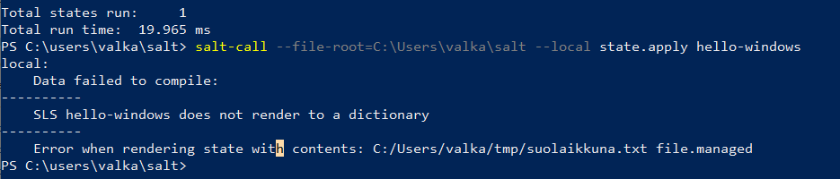
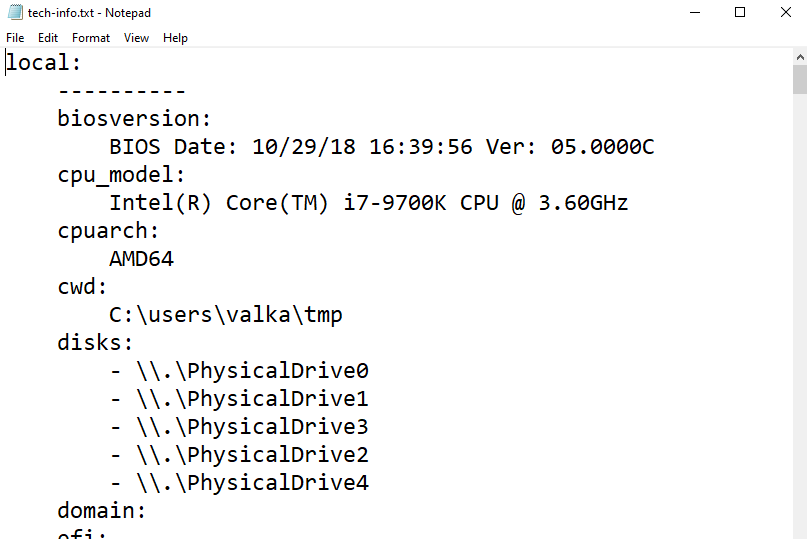
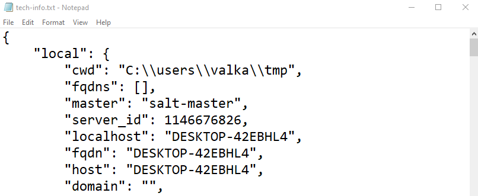
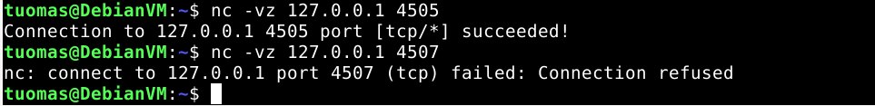
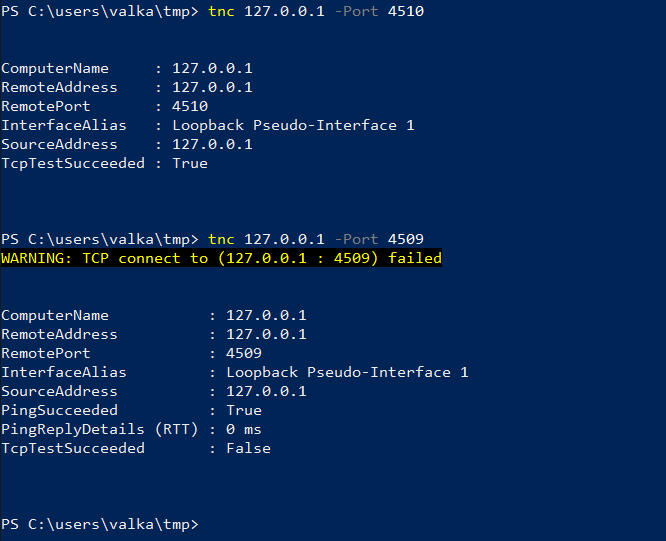

Course material: https://terokarvinen.com/2022/palvelinten-hallinta-2022p2/

Environment: My Windows 10 PC with plenty of storage. VirtualBox VM running Debian 11 XFCE. VM has 4 GB of RAM and 40 GB of disk space.

---

## Hello Windows Salt!

**Objective: Write a Salt state that creates a file called "suolaikkuna.txt".**

I started by creating an init.sls file to a Salt project directory called hello-windows. ([source](https://blog.netwrix.com/2018/05/17/powershell-file-management/))

    > cd C:\users\valka\salt\hello-windows
    > New-Item -Path '.\init.sls' -ItemType File

In File Explorer, I opened init.sls in Notepad and wrote the instructions for creating the file.

```
C:/Users/valka/tmp/suolaikkuna.txt
  file.managed
```

I ran the Salt state with `salt-call`. The flag `--file-root` tells Salt to use the specified directory as root.

    > salt-call --file-root=C:\Users\valka\salt --local state.apply hello-windows

I got an error. I forgot to add a colon to the Salt state.



```
# OLD
C:/Users/valka/tmp/suolaikkuna.txt
  file.managed

# NEW
C:/Users/valka/tmp/suolaikkuna.txt:
  file.managed
```

I ran the state again. This time it was successful.


I checked that the file created was actually there.


---

## No notes, no pen

**Objective: Gather the Windows machines technical information to a text file. Optional: can you save them in JSON-format?**

I used the `items` state function from the `grains` module to gather information. I wrote the information to a .txt file.

    > salt-call --local grains.items > tech-info.txt



For the JSON format, I used `--out` flag to specify the output as JSON. ([source](https://docs.saltproject.io/en/latest/ref/output/all/salt.output.json_out.html))

    > salt-call --local grains.items --out=json > tech-info.txt



---

## Knock knock. Is the TCP port open?

**Objective: Find out if a port is open or closed. Try it on both Linux and Windows. Show an open and a closed port on both operating systems.**

### Linux

I installed netcat.

    $ sudo apt-get update
    $ sudo apt-get install netcat

I tried connecting to ports 4505 and 4507. 4505 is a port used by Salt Master and port 4507 is, to my knowledge, not in use. (source: man nc, screenshots from the lecture, [speedguide.net](https://www.speedguide.net/port.php?port=4505))

    $ nc -vz 127.0.0.1 4505
    Connection to 127.0.0.1 4505 port [tcp/*] succeeded!
    $ nc -vz 127.0.0.1 4507
    nc: connect to 127.0.0.1 port 4507 (tcp) failed: Connection refused



## Windows

I used `tnc` (Test-NetConnection) to connect to ports. (source: man tnc)

    > tnc 127.0.0.1 -Port 4510
    > tnc 127.0.0.1 -Port 4509

Port 4510 is commonly used by Microsoft Silverlight plugin which adds interactivity to browsers. ([source](https://www.speedguide.net/port.php?port=4510)). Port 4509 was not in use.



---

## Sources

- Tero Karvinen: https://terokarvinen.com/2022/palvelinten-hallinta-2022p2/
- Ian Skur: https://blog.netwrix.com/2018/05/17/powershell-file-management/
- Salt project: https://docs.saltproject.io/en/latest/ref/output/all/salt.output.json_out.html
- man nc
- Screenshots from the lecture
- Speedguide: https://www.speedguide.net/