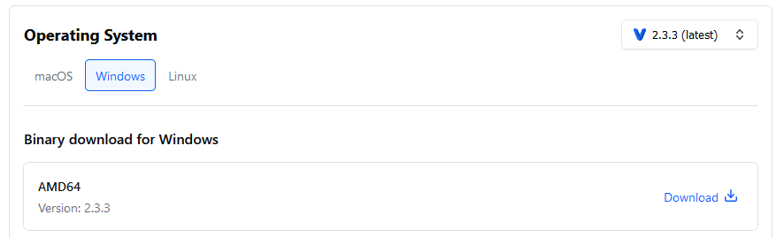
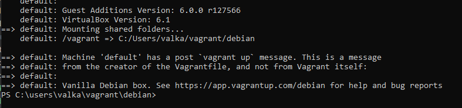
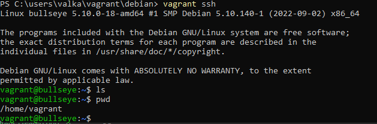
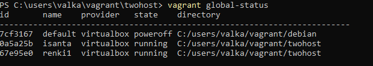
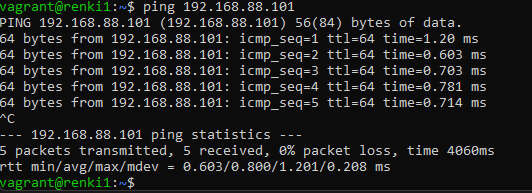
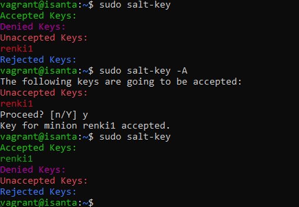

Course material: https://terokarvinen.com/2022/palvelinten-hallinta-2022p2/

Environment: Windows 11 laptop with 40 GB of free disk space.

---

## Read and summarize

- Karvinen 2017: [Vagrant Revisited – Install & Boot New Virtual Machine in 31 seconds](https://terokarvinen.com/2017/04/11/vagrant-revisited-install-boot-new-virtual-machine-in-31-seconds/) (I recommend using `vagrant init debian/bullseye64` as VM)

Vagrant requires only these three commands to get a machine up:

    $ vagrant init debian/bullseye64
    $ vagrant up
    $ vagrant ssh

- Karvinen 2021: [Two Machine Virtual Network With Debian 11 Bullseye and Vagrant](https://terokarvinen.com/2021/two-machine-virtual-network-with-debian-11-bullseye-and-vagrant/)

You can setup two Virtual Machines to run on the same network but on different local IP addresses with one Vagrant script.

- Karvinen 2018: [Salt Quickstart – Salt Stack Master and Slave on Ubuntu Linux](https://terokarvinen.com/2018/salt-quickstart-salt-stack-master-and-slave-on-ubuntu-linux/)

For basic master-slave architecture Salt implementation, install salt-master and salt-minion on the respective machines. Then edit the slave machine minion file at /etc/salt/minion. Add `master: MASTER IP HERE` and, if you want to, `id: RANDOM NAME`. Restart the minion service. Run `salt-key -A` (`-A` = accept keys) to accept the slave connecting to master. Now you can control the slave with the master.

---

## Hello Vagrant

**Objective: Install a Virtual Machine with Vagrant.**

I downloaded Vagrant Windows AMD64 binary from the [official website](https://developer.hashicorp.com/vagrant/downloads).



I ran the installer wizard with the default options and restarted my PC.

I opened Windows Powershell as administrator after searching for it in the start menu.

I created the folder structure for C:\users\valka\vagrant\debian with `mkdir`.

I created a new Vagrantfile.

    > vagrant init debian/bullseye64

`vagrant init` creates a new Vagrantfile and a specified I wanted preconfigured settings for Debian. Bullseye is the codename given to Debian version 11 and 64 refers to 64-bit version.

I created and started up the new Virtual Machine.

    > vagrant up



I was able to connect to the Virtual Machine via SSH.

    > vagrant ssh



---

## Private network

**Objective: Install two Virtual Machines to the same network with Vagrant. Name one VM "isanta" and the other "renki1". Test that "renki1" can connect to the "isanta" VM (ping or nc).**

I created a new folder to C:\users\valka\vagrant\twohost.

I created a new Vagrantfile with `vagrant init`. I configured it to create two Virtual Machines with different local IP addresses. (Source: [Tero Karvinen](https://terokarvinen.com/2021/two-machine-virtual-network-with-debian-11-bullseye-and-vagrant/))

```
Vagrant.configure("2") do |config|
  config.vm.box = "debian/bullseye64"

  config.vm.define "isanta" do |isanta|
		isanta.vm.hostname = "isanta"
		isanta.vm.network "private_network", ip: "192.168.88.101"
	end

	config.vm.define "renki1", primary: true do |renki1|
		renki1.vm.hostname = "renki1"
		renki1.vm.network "private_network", ip: "192.168.88.102"
	end
end
```

I shutdown my previous machine just so it doesn't run in the background.

    > vagrant global-status
    id       name    provider   state   directory
    ------------------------------------------------------------------------
    7cf3167  default virtualbox running C:/users/valka/vagrant/debian

    > vagrant halt 7cf3167

I created and started the two new Virtual Machines with `vagrant up`.

I listed all the Vagrant VMs with `vagrant global-status`.



I connected to "renki1" via SSH.

    > vagrant ssh renki1

I pinged "isanta" from "renki1" and got a response.

    > ping 192.168.88.101



---

## Salt master-slave

**Objective: Implement a master-slave architecture with Salt over a network. Set the previous assignment's "renki1" as a slave to "isanta".**

While still connected to the previous assignments "renki1" Virtual Machine I updated packages and installed salt-minion.

    $ sudo apt-get update
    $ sudo apt-get install salt-minion

I modified /etc/salt/minion.

    $ sudoedit /etc/salt/minion

    # I added these lines to the start of the file:
    master: 192.168.88.101
    id: renki1

I restarted the salt-minion service so the changes to the settings take effect.

    $ sudo systemctl restart salt-minion.service

I exited the "renki1" SSH session and connected to "isanta".

    $ exit
    > vagrant ssh isanta

I updated packages and installed salt-master.

    $ sudo apt-get update
    $ sudo apt-get install salt-master

I authorized the slave machine to take orders from the master with `salt-key`.

    $ sudo salt-key -A

- `-A` flag is used to accept keys.



I was able to run commands on the slave machine with Salt.

    $ sudo salt '*' cmd.run "echo Hello"


---

## Creating a Salt module

**Objective: Create the first version of your own Salt module. The mini project must have some sort of use case even if it's made up. Create a page (Github, Gitlab) for project that outlines the basic information about the project. The functionality of the module must be tested but it doesn't have to be finished.**

I decided to make a module that installs a starter pack of useful programs. The module can be found [here](https://github.com/tuomasvalkamo/starter-module).

---

## Sources

- Tero Karvinen: https://terokarvinen.com/2022/palvelinten-hallinta-2022p2/
