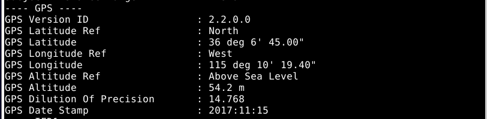

Course material: https://terokarvinen.com/2022/tunkeutumistestaus-ict4tn027-3010-syksylla-2022/

Environment: VirtualBox VM running Debian 11 XFCE. VM has 4 GB of RAM and 40 GB of disk space. I've preinstalled ufw, micro, and bash-completion. Firewall is active with port 22/tcp allowed.

---

## Darknet Diaries / Herrasmieshakkerit

**Objective: Listen to an episode of Darknet Diaries or Herrasmieshakkerit and summarize.**

I listened to episode 26 (featuring Otto Ebeling) of the Herrasmieshakkerit podcast by WithSecure Chief Research Officer Mikko Hyppönen and Wolt VP of Security Tomi Tuominen. I chose this episode because Otto Ebeling will be a guest speaker later in the course.

- The scale of security operations in a company like Facebook is massive. A hundred people work in a team combating spam in their services.

- At Facebook Otto Ebeling worked on application security which includes analyzing code produced by other teams at the company. This is different from the typical cyber security job where your focus is on the network and firewall.

- After moving back to Finland, Otto Ebeling has been focused on WEB3 security. The fast pace of the crypto field often means security is overlooked in new projects. Instead, it has become commonplace to "outsource" the security work by offering large bug bounties.

---

## Install WebGoat

**Objective: Install WebGoat and verify that you can log in.**

I followed [this guide](https://terokarvinen.com/2020/install-webgoat-web-pentest-practice-target/) by Tero Karvinen.

First I updated packages and installed Java and Wget.

```
$ sudo apt-get update
$ sudo apt-get -y install openjdk-11-jre wget
``` 


I downloaded WebGoat .jar file file with Wget from Tero Karvinen's website and ran the program with the java -jar command.


I browsed to http://localhost:8080/WebGoat, created a new user and logged in.


WebGoat install was successful.

---

## WebGoat assignments

**Objective: Solve the "HTTP Basics" and "Developer Tools" assignments from WebGoat**

### HTTP Basics

The HTTP Basics assignment required me to find out what kind of HTTP request the form on the page was using and additionally what the "magic number" was.

By looking at the HTML DOM, I quickly figured out that the method parameter on the *form* element was set to POST. I didn't find any traces of the magic number, so I wrote down POST in the form and pressed submit.


Simultaneously I monitored the developer tools Network tab (F12). I saw that a POST request was made to a file called *attack2*. I clicked on the row to find out more information.


After a short while investigating the HTTP header I looked at the actual request body. I clicked to the Request tab, and I saw the magic number I was looking for. I entered the values to the form and completed the assignment.


### Developer Tools


I opened the console and called the *phoneHome* function. It returned the number I was looking for.


I opened the developer tools network tab and located a HTTP request called *network*. It contained *networkNum*.


---

## OverTheWire 0-2

**Objective: Solve the first three levels of [OverTheWire: Bandit](https://overthewire.org/wargames/bandit/) (0-2)**

### Level 0

I installed SSH client so I can connect to OverTheWire.

```
$ sudo apt-get update
$ sudo apt-get install openssh-client
```

I connected to Bandit port 2220 via SSH.

```
$ ssh -p 2220 bandit0@bandit.labs.overthewire.org
```


### Level 1

I used *cat* to read the readme file.

```
$ cat readme
NH2SXQwcBdpmTEzi3bvBHMM9H66vVXjL
```


I was able to log in to the next stage with the password.

### Level 2

I read the [material](https://tldp.org/LDP/abs/html/special-chars.html) that OverTheWire recommended for this level and found a section that instructs using the *./* prefix when reading a file called *-*. From what I understood, *cat -* refers to the previous file location or the output of the previous command. I was a bit unclear on which on it was. Either way I used the new trick and completed the assignment.

```
$ cat ./-
rRGizSaX8Mk1RTb1CNQoXTcYZWU6lgzi
```


---

## Kali Linux

**Objective: Install Kali Linux to a Virtual Machine**

I downloaded a VirtualBox image of Kali [from their website](https://www.kali.org/get-kali/#kali-virtual-machines). I unzipped the .7z file and added the .vbox file to VirtualBox by clicking Machine > Add.

I tested the user login with the kali/kali credentials that came with the image. Login was successful.


---

## GenZ Hack Challenge 2021

**Objective: Solve one challenge from the 2021 Challenge.fi hack challenge (e.g. *Where was this picture taken* or *Encoding basics*).**


I decided to solve the *Where was this picture taken 1/4* challenge. First, I downloaded the image to my Windows computer and looked at the image properties. I found GPS latitude and longitude data.


I was unable to copy the coordinates to my clipboard from the Windows image properties menu, so I decided to switch to Linux and try out some the image analyzing tools that the teacher recommended during class.

I installed ExifTool program. According to the manual (*$ man exiftool*) ExifTool is used to read and write image metadata.

```
$ sudo apt-get install exiftool
```


I read instructions from the manual and found a suitable command from the *examples* part.

```
exiftool -a -u -g1 a.jpg

# -a shows duplicate tags
# -u shows unknown tag values
# -g sorts the output by tag group. -g1 is best suited 
for analyzing image location. 
```


The GPS data is now in a more usable form.



It took me a while to find out how to turn the GPS data from ExifTool to the "normal" coordinate format I assume the challenge is looking for. I ended up using a [coordinate converter](https://coordinates-converter.com/) that I found. I entered the longitude and latitude values to the corresponding fields and the map pointed to the replica Eiffel Tower in Las Vegas, located at 36.1125, -115.172056.


I tried to submit my answer to challenge.fi but the submit didn't work. They maybe disabled it for the previous year's challenge.

---

## Sources

- Tero Karvinen, https://terokarvinen.com/2022/tunkeutumistestaus-ict4tn027-3010-syksylla-2022/
- Tero Karvinen, https://terokarvinen.com/2020/install-webgoat-web-pentest-practice-target/
- Tldp.org, https://tldp.org/LDP/abs/html/special-chars.html