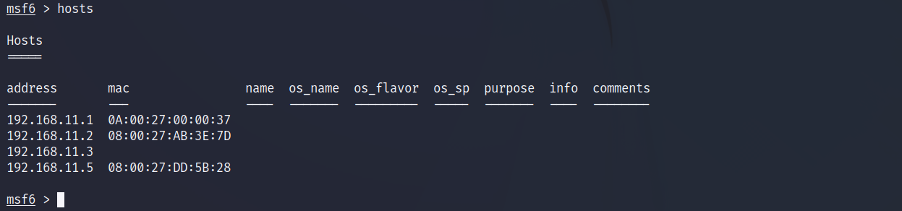
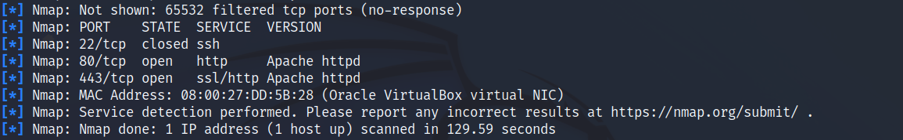
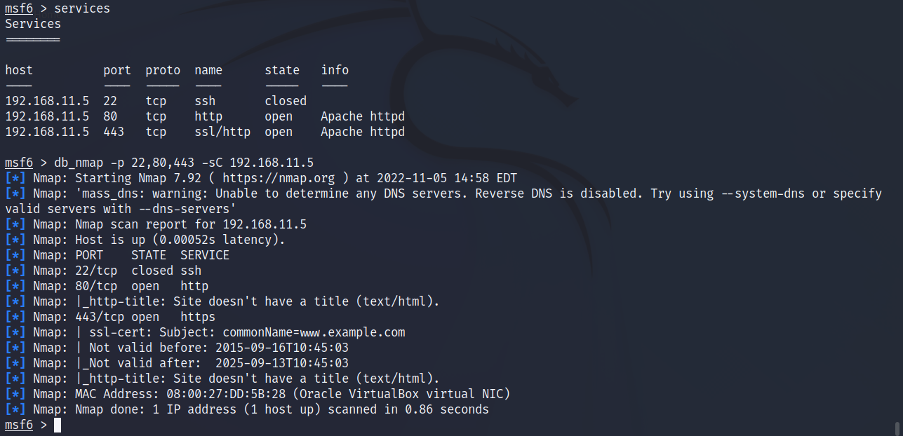
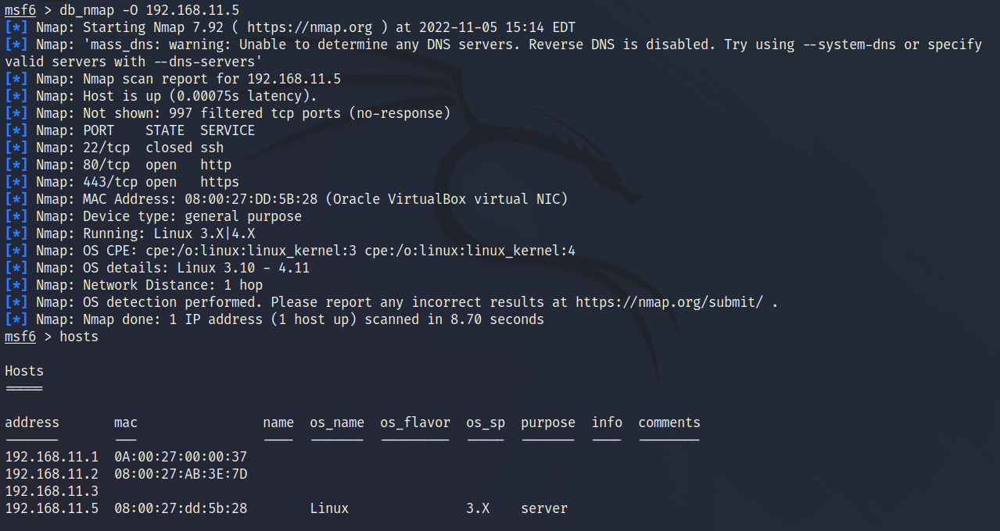

Week 2 of Penetration Testing course.

Course material: https://terokarvinen.com/2022/tunkeutumistestaus-ict4tn027-3010-syksylla-2022/

Environment: VirtualBox VM running Kali Linux. VM has 2 GB of RAM and 80 GB of disk space.

## Read and summarize

**Objective: Read the Jaswal 2020: Mastering Metasploit - 4th edition: Chapter 1: Approaching Penetration Test Using Metasploit (start from "Conducting a penetration test with Metasploit")**

- Basic terms used in Metasploit:

  - Exploits (code that is exploit target vulnerability)
  - Payload (code that runs in the target after successful exploitation)
  - Auxiliary (Metasploit modules that give additional functionality)
  - Encoders (Obfuscate modules to avoid detection)
  - Meterpreter (Payload that uses DLL injection. Provides additional functionality that can be run on the target system.)

- Benefits of Metasploit:
  - Open source
  - Support for testing large networks and natural naming conventions
  - Smart payload generation and switching mechanism (Meterpreter)
  - Cleaner exits. Metasploit often doesn't crash the target system on exit where others might.

## Metasploitable

**Objective: Install Metasploitable 2 to the same Host-only network with your attacking computer.**

(I did this step earlier so I'm writing from what I remember)

### Install and configure

I downloaded [Metasploitable 2](https://sourceforge.net/projects/metasploitable/), unzipped the file, and added the VM to my VirtualBox by clicking Add > Machine. For options, I set _Type_ to unknown and _Version_ to unknown 64-bit.

To configure the Host-only network connection I clicked on File > Host Network Manager, inside VirtualBox. I created a new Host-only network by clicking the Create button in the top left corner and enabled DHCP Server by clicking the box in the row where my new network was listed.

To set the Host-only network to Metasploitable 2, I clicked on the settings button of my Metasploitable 2 VM. In the Network tab, I changed _Adapter 1_ to be attached to Host-only Adapter and the name to be the new Host-only network I had configured.

I did the same to my Kali Linux VM except I added the Host-only network to _Adapter 2_, leaving _Adapter 1_ to the default NAT. This was done so that I could enable Internet connection in Kali if I so wished.

### Testing the connection

I started up Kali Linux and pinged www.google.com. I got back a response which I expected.

I opened Kali network settings and disconnected the Adapter 1 NAT cable. This was so that there would be no access to the outside Internet during the penetration testing.

I pinged www.google.com again and this time I got no response, as expected.

I started the Metasploitable 2 VM, logged in the default credentials, and pinged www.google.com. I got no response which confirmed that the machine was not connected to the Internet.

I looked up my local IP address for the Metasploitable 2 machine by typing the _ifconfig_ command

    $ ifconfig

I pinged the Metasploitable 2 local IP in Kali to confirm that the both the machines were operating on the same network. The ping received a response which confirmed it.

## Port scanning Metasploitable

**Objective: Port scan Metasploitable 2. Utilize additional techniques (banner grabbing, NSE...). Analyze results of the port scan. Store port scan results to Metasploitable DB and files.**

I started off by running `sudo msfdb run` to initialize my Metasploit database. Inside the msf console, I checked the status of my database connection with `db_status` and observed that I was connected to msf, and the connection type was PostgreSQL.

    $ sudo msfdb run
    msf6 > db_status

For this project, I created a workspace called _metasploitable-2_.

    msf6 > workspace -a metasploitable-2

I used Nmap to port scan the target. I chose to use the `-sV` option to specify a version scan so that I could quickly get an overlook of the open ports and services running in them (source: man nmap). With `db_nmap` the results get stored in the PostgreSQL database so I used `services` to get a bit more of a readable output.

    msf6 > db_nmap -sV 192.168.11.4
    msf6 > services

I saw that there were numerous ports open with different services running in them. All the ports used TCP protocol. From searching by the service name in [exploit-db.com](https://www.exploit-db.com/) I found out that there were backdoor command execution exploits available for at least vsftpd 2.3.4 and UnrealIRCd.

I scanned again but this time using the `-sC` option which specifies a script scan that runs Metasploit’s default list of common scripts. There was some additional information on port 21/tcp and others but nothing really stood out to me.

    msf6 > db_nmap -sC 192.168.11.4

## Gaining access to Metasploitable

### VSFTPD 2.3.4

I decided to try to exploit the vsftpd 2.3.4 vulnerability since we went over it during the previous lesson and I wanted to replicate the results.

I searched for the exploit in Metasploit and selected it with the `use` command.

    msf6 > search vsftpd 2.3.4
    msf6 > use 0

I looked at the exploit options and noticed that it requires RHOSTS to be set. I set it with the `setg` command which sets a global variable.

    msf6 > show options
    msf6 > setg RHOSTS 192.168.11.4

I ran the exploit and gained access to a command shell.

Next, I wanted to gain elevated access by using Meterpreter. I put the current command shell session to the background with the `background` command. I then listed my sessions with `sessions` and opened a new Meterpreter session with `sessions -u 1`. I entered session 2 with Meterpreter.

    background
    msf6 > sessions
    msf6 > sessions -u 1
    msf6 > sessions 2

### UnrealIRCd

Port 6667/tcp was running UnrealIRCd which had a backdoor command execution exploit available. I backed out of the previous session with `background` and from the current module with `back`. I then searched Metasploit for the UnrealIRCd exploit.

I selected the exploit with the `use` command and looked up the options with `show options`. The only thing it required, not set by default, was the RHOSTS variable which I had defined earlier with the `setg` command.

I ran the exploit but got back an error message saying I need to set a payload for the exploit. I read more about payloads in Metasploit. A common use case for payloads is to open a shell. Using [this Rapid7 guide](https://docs.rapid7.com/metasploit/working-with-payloads/) I found a command that shows all the compatible payloads for an exploit.

    msf6 > show payloads

I had quite a few to choose from but I landed on /cmd/unix/reverse because the Rapid7 guide had it listed as one of the defaults Metasploit uses. I ran the exploit again with `run`. This time it got caught up by a missing LHOST option in the payload. I set the LHOST to the target IP.

I ran the exploit. The exploit went through but no session was created.

I quickly realized my mistake which was setting the LHOST listening address to the target IP instead of my own. I changed the option to `set LHOST 192.168.11.3` and ran exploit again. This time it worked and a shell session was opened.

I upgraded the session to use Meterpreter and gained root access.

    msf6 > sessions -u 3
    msf6 > sessions 4

## VulnHub: Mr. Robot

**Objective: Penetrate a machine from [VulnHub](https://www.vulnhub.com/). Pick an easy one.**

I picked [Mr. Robot](https://www.vulnhub.com/entry/mr-robot-1,151/) as the challenge I would tackle. I had seen this one mentioned somewhere as a good beginner machine for pen-testing. It has three keys hidden in different locations. The difficulty level is considered beginner-to-intermediate but since the keys get progressively more, I thought I would at least attempt to get some of them.

I booted up the Mr. Robot VM and switched to Kali Linux. I cleared the previous data from Metasploit database.

    $ sudo msfdb reinit
    $ sudo msfconsole

First, I needed to find out the local IP address of the target machine. I did a ping sweep with nmap to find all the local IPs.

    msf6 > db_nmap -sn 192.168.11.0-255

192.158.11.5 seems to be the one since it's the next number to be reserved. I port scanned the IP, this time telling nmap to scan all the ports instead of the 1000 most popular ones that it defaults to.

    msf6 > db_nmap -p1-65535 -sV 192.168.11.5

The scan took a while to complete but in the end it listed ports 22/tcp, 80/tcp, and 443/tcp. The closed port, 22/tcp is the default SSH port. The two open ports 80/tcp and 443/tcp are HTTP and HTTPS respectively. This scan didn't really yield any usable data so I tried a script scan on the three ports.

The script scan didn't reveal anything new either. Next, I enabled Operating System detection using the `-O` option.

    msf6 > db_nmap -O 192.168.11.5

The port scan with OS detection enabled showed that the machine was a Linux version 3.X or 4.X. I knew this already but I was hoping that it would give some additional information to work with.

I ran another scan with `-A` option enabled. `-A` just runs `-O`, `-sV`, `-sC`, and `--traceroute` with one go. I wanted to make sure nothing I didn't miss anything. The scan didn't reveal anything new.

**UPDATE:** I gave up on this and watched a [walkthrough](https://www.youtube.com/watch?v=vxFYfJbQAoc). Maybe I could've gotten the first flag. The walkthrough does go off in a different direction than what I was thinking. The harder flags were out of the scope for this week’s assignments.

## Sources

- Tero Karvinen, https://terokarvinen.com/2022/tunkeutumistestaus-ict4tn027-3010-syksylla-2022/
- `$ man nmap`
- Exploit-db.com, https://www.exploit-db.com/
- Rapid7, https://docs.rapid7.com/metasploit/working-with-payloads/
