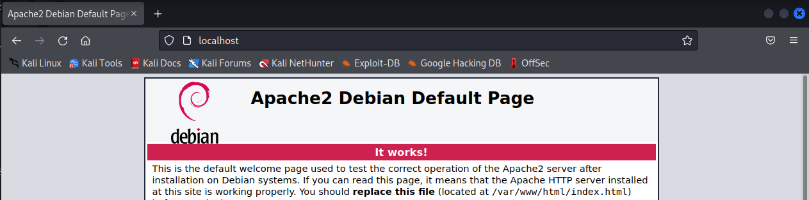
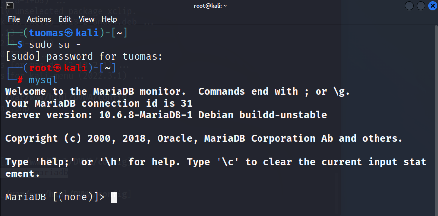
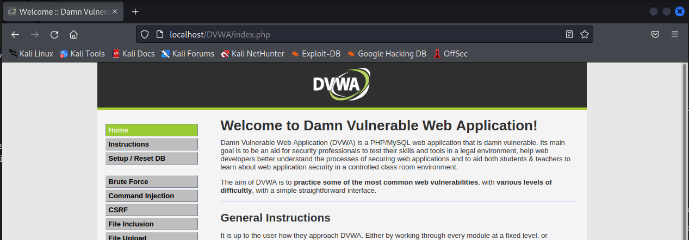
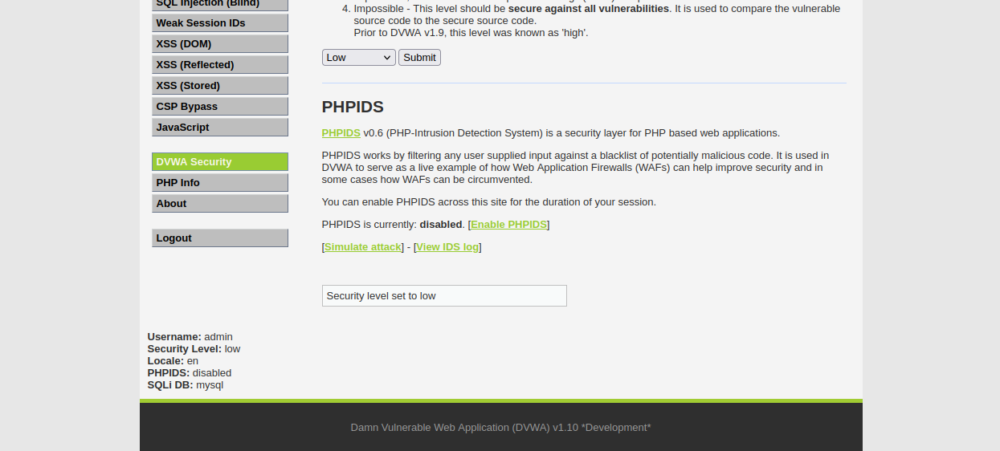
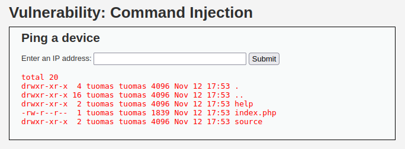
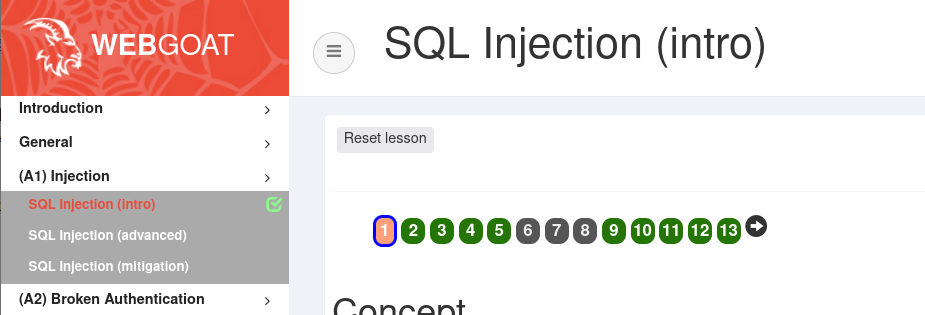
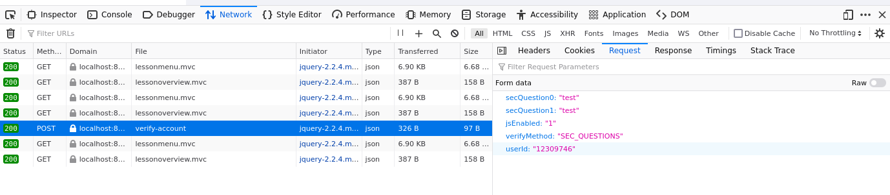
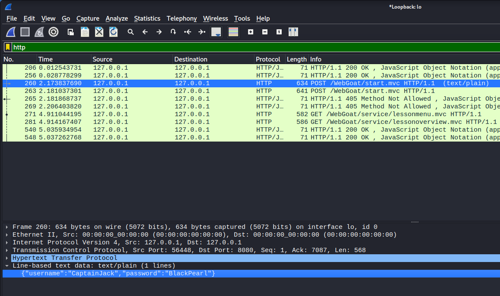

Week 3 of Penetration Testing course.

Course material: https://terokarvinen.com/2022/tunkeutumistestaus-ict4tn027-3010-syksylla-2022/

Environment: VirtualBox VM running Kali Linux. VM has 2 GB of RAM and 80 GB of disk space.

---

## Read/watch and summarize

[OWASP 10 2017 (pdf)](https://terokarvinen.com/2022/tunkeutumistestaus-ict4tn027-3010-syksylla-2022/owasp-top-10-2017.pdf): A1 Injection, A2 Broken Authentication, A3 Sensitive Data Exposure, A7 Cross Site Scripting. (Summarize how the attacks work in practice)

- A1 Injection: Attacker modifies the parameter sent to the server to include malicious code.

- A2 Broken Authentication: Attacker uses brute forcing to test a password list against an account login.

- A3 Sensitive Data Exposure: A site doesn't use TLS and an attacker monitors network traffic, steals the user’s session cookie, uses it to hijack the user's authenticated session.

- A7 Cross Site Scripting: Attackers insert malicious JavaScript code to a site and hijack the user's session cookie. 

€ Percival & Samancioglu 2020: The Complete Ethical Hacking Course (video): [Chapter 21: Cross Site Scripting](https://learning.oreilly.com/videos/the-complete-ethical/9781839210495/9781839210495-video21_1) (7 videos, ~25 min)

- Cross Site Scripting (XSS) is an exploit/vulnerability where an attacker can embed malicious JavaScript code to a website
- Reflected XSS is where the attacker sends the victim a link to a website that has the XSS vulnerability. The attacker can embed JavaScript code in the URL.
- Stored XSS is where an attacker stores the malicious JavaScript on a website where it affects victims without the attacker needing to send links to them.

---

## Cross site story

**Objective: Write a fictional story of an XSS-attack.**

The attacker finds a website with an input field vulnerable to XSS and modifies the URL to call a script that sends/requests data from the attacker's server. The attacker sends the malicious link to a victim via email. The victim clicks the link to the seemingly innocent looking website without noticing the modified URL. The attacker's JavaScript runs on the victim’s browser and collects information about the victim’s session including cookies. The script sends these to the attacker. The attacker uses the cookies to hijack the victim’s authenticated session and gains access the victims account on the website.

---

## SELECT * FROM student

**Objective: Solve [SQLZoo](https://sqlzoo.net/wiki/SQL_Tutorial) chapters: 0 SELECT basics and 2 SELECT from World 1-5**

### SELECT basics

#### Task 1

I changed the name parameter to *Germany*.

```
# Old
SELECT population FROM world
  WHERE name = 'France'

# New
SELECT population FROM world
  WHERE name = 'Germany'
```

#### Task 2

I changed the IN input to *Sweden*, *Norway*, and *Denmark*.

```
# Old
SELECT name, population FROM world
  WHERE name IN ('Brazil', 'Russia', 'India', 'China');

# New
SELECT name, population FROM world
  WHERE name IN ('Sweden', 'Norway', 'Denmark');
```

#### Task 3

I changed the BETWEEN parameters to 200,000 and 250,000.

```
# Old
SELECT name, area FROM world
  WHERE area BETWEEN 250000 AND 300000

# New
SELECT name, area FROM world
  WHERE area BETWEEN 200000 AND 250000
```

### SELECT from World

#### Task 1

Observations: *name* field is type varchar(50), *continent* field is type varchar(60), and *population* field is type decimal(11,0).

#### Task 2

I changed the WHERE clause to >= 200000000.

```
# Old
SELECT name FROM world
WHERE population = 64105700

# New
SELECT name FROM world
WHERE population >= 200000000
```

#### Task 3

I divided gpd by population to get the GDP per capita.

```
SELECT name, gdp/population FROM world 
WHERE population >= 200000000;
```

#### Task 4

I used `WHERE continent = 'South America'` to get the right results.

```
SELECT name, population/1000000 FROM world
WHERE continent = 'South America';
```

#### Task 5

I used the IN clause to query for a list of names.

```
SELECT name, population FROM world
WHERE name IN ('France', 'Germany', 'Italy')
```

---

## Darn Low Security

**Objective: Install DVWA Damn Vulnerable Web App.**

For this install I followed [a guide](https://www.youtube.com/watch?v=WkyDxNJkgQ4) by Robin Wood, the creator of DVWA.

I opened my Kali VM and cloned the DVWA GitHub repository to my home directory.

    $ git clone https://github.com/digininja/DVWA.git

I cloned all the files to /var/www/html.

    $ sudo mv DVWA/ /var/www/html/

I started the apache2 service and checked that the default page showed. Apache was installed in this Kali image by default.

    $ sudo systemctl start apache2



In Firefox, I navigated to http://localhost/DVWA/setup.php and clicked on the Create Database button. Nothing happened as I expected but I wanted to recreate this step because the guide did this as well.

I started the MariaDB service.

    $ sudo systemctl start mariadb

I switched to root user and started the MariaDB console.

    $ sudo su -
    $ mysql



I ran the commands for creating the database, creating the user, granting privileges, and flushing privileges. They all went through OK.

```
mysql> create database dvwa;

mysql> create user dvwa@localhost identified by 'p@ssw0rd';

mysql> grant all on dvwa.* to dvwa@localhost;

mysql> flush privileges;
```

I went into the browser and clicked the Create Database button again. This time it worked and redirected me to a login screen. A logged in with admin/password credentials and got to the admin panel.



In the DVWA Security page I set the application security level to Low.



**Update:** I realized I could've just used the Metasploitable 2 web page to go to the already installed DVWA. I just needed to go to the local IP where the Metasploitable 2 VM resides.

---

## Execute!

**Objective: Solve DVWA "Command Injection".**

I read up on command injections from the [OWASP link](https://owasp.org/www-community/attacks/Command_Injection) in the DVWA page. It said that a common way to inject a command is to use a semicolon and type another command after it. I listed all the files in the directory.

    ; ls -al



I don't think there was anything else to this task. The challenge was getting around input validation which on low security level there was none.

---

## WebGoat

**Objective: Solve the following WebGoat challenges:**

- A1 Injection (intro)
- A2 Broken authentication:
  - Authentication bypasses: 2 2FA Password Reset
- A3 Sensitive data exposure
  - Insecure Login: 2 Let's try
- A7 Cross Site Scripting (XSS): Cross site scripting
  - 2 What is XSS?
  - 7 Try It! Reflected XSS
- A8:2013 Request Forgeries:
  - Cross-Site Request Forgeries
    - 3 "Basic Get CSRF Exercise"
    - 4 "Post a review on someone else’s behalf".


I switched to my Debian Xfce VM where I had WebGoat installed.

### A1 Injection (intro)

I had already completed this assignment, so I skipped it.



### A2 Broken authentication

**Objective: Bypass the 2FA.**

I started by entering *test* to both the fields and sending the form. I monitored traffic in the developer tools Network page and saw that a POST request was made to a file called *verify-account*. I clicked on the request body and found the security questions. 



I first tried to delete the questions from the request like in the example but that wasn't possible through the developer tools.

I wanted to try Wireshark and see if I could modify the POST request. I switched back to Kali VM because it had Wireshark already installed. I installed WebGoat by following [this guide](https://terokarvinen.com/2020/install-webgoat-web-pentest-practice-target/) by Tero Karvinen. In the end I wasn't able to change the parameters in Wireshark.

Next I read some of the tips in the course assignment page and I got the impression that this task should be solvable with just the developer tools.

I tried deleting, changing the values, and renaming the hidden verifyMethod input field but that didn't work.

I tried changing the input type to checkbox to see if I could somehow change the value to a TRUE/FALSE option. It didn't work.

I decided to look at the WebGoat hints for this challenge. It advised to rename the secQuestion parameters.

I'm moving on to the next task.

### A3 Sensitive data exposure

**Objective: Use a packet sniffer to intercept a request.**

I used Wireshark to monitor network traffic. I filtered the results to include only HTTP requests and found the right request with the username and password credentials.



### A7 Cross Site Scripting (XSS)

#### 2 What is XSS?

I didn't get any alerts when pasting the JavaScript to my address bar. Not sure if I did something wrong.

#### 7 Try It! Reflected XSS

I didn't get any alerts or console logs. Not sure what's wrong.

### A8:2013 Request Forgeries

...

---

## Sources

- DVWA, https://github.com/digininja/DVWA.git
- Robin Wood, https://www.youtube.com/watch?v=WkyDxNJkgQ4
- OWASP, https://owasp.org/www-community/attacks/Command_Injection
- Tero Karvinen, https://terokarvinen.com/2020/install-webgoat-web-pentest-practice-target/
