Course material: https://terokarvinen.com/2022/tunkeutumistestaus-ict4tn027-3010-syksylla-2022/

Environment: VirtualBox VM running Kali Linux. VM has 2 GB of RAM and 80 GB of disk space.

---

## Read and summarize

**Objective: Read the material and summarize with a few points.**

**€ Santos et al: The Art of Hacking (Video Collection): [..] [4.3 Surveying Essential Tools for Active Reconnaissance.](https://learning.oreilly.com/videos/the-art-of/9780135767849/9780135767849-SPTT_04_00)**

- Nmap is the most versatile and stable port scanner 

**Lyon 2009: Nmap Network Scanning: [Chapter 1. Getting Started with Nmap](https://nmap.org/book/nmap-overview-and-demos.html)**

- First steps when pen-testing a network could be verifying the target IP ranges, doing a list scan (`-sL`), and scanning for more details on services listening to ports and OS versions (`-sV`, `-O`, `-A`).

**Glance over Lyon 2009: Nmap Network Scanning: [Chapter 15. Nmap Reference Guide](https://nmap.org/book/man.html):**

**[Port Scanning Basics](https://nmap.org/book/man-port-scanning-basics.html) (What do these mean?: open, closed, filtered)**

- Nmap classifies scanned ports into different categories. These are open, closed, filtered, unfiltered, open|filtered, and closed|filtered
- Open: Port has an application listening to it.
- Closed: Nmap receives a response from a port but there is no service listening to it. It might be worth to scan closed ports on a later date to check if they have opened up.
- Filtered: A port could be open, but Nmap can't be certain because packet filtering is preventing its probes from reaching it. Nmap retries the port scan just in case it didn't go through because of network congestion. This can increase port scan time dramatically.

**[Port Scanning Techniques](https://nmap.org/book/man-port-scanning-techniques.html) (What are: -sS -sT -sU)**

- Nmap has a number of different port scanning techniques available.
- -sS: TCP SYN scan, the default option in Nmap. Sends a SYN packet and expects an ACK response if the port is listening or RST (reset) if the port is closed. It never actually completes the Three-Way Handshake connection so it's a somewhat stealthy scan.
- -sT: TCP connect scan. Nmap uses the `connect` system call to connect to the target and Berkeley Sockets API to gather status information on the connection attempt. This is the same way web browsers handle connections and it's not stealthy at all.
- -sU: UDP scan, sends a UDP packet to a port and waits for a UDP packet response to prove it's open. UDP scanning is often very slow because the responses aren't as clear as TCP, forcing Nmap to try the same ports many times. Additionally, many hosts limit UDP packet response rates to, for example, 1 packet per second. This means scanning ports 1-65535 would take around 18 hours.

**Glance over `man nmap`**

- The manual on Nmap provides easy-to-understand descriptions on all available options.

---

## How Nmap works

**Objective: Do the following tests and analyze the network traffic using a sniffer (Wireshark). Explain why Nmap sends the particular packets.**

I decided to run the scans to a Metasploitable 2 machine I had installed so I could test the scanning in an environment other than just scanning my own machine.

### a) nmap TCP connect scan -sT

I ran the following command:

    $ sudo nmap -sT -p21 192.168.11.4

- -sT tells Nmap to run a TCP connect scan.
- -p21 limits the scan to only port 21/tcp. I know that Metasploitable 2 has an FTP service listening to it.
- 192.168.11.4 is the local IP of the Metasploitable 2 machine.

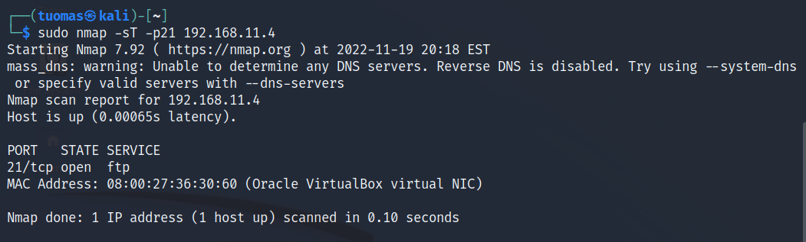

I sniffed the network traffic with Wireshark. Wireshark intercepted six packets when I ran the command. 

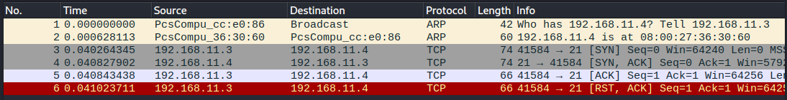

The first two packets use ARP protocol. Nmap starts the scan by doing host discovery. It checks that the host is up. Usually this is done by sending ICMP, TCP SYN, and TCP ACK packets but because I'm scanning a host in the same local ethernet network Nmap uses ARP packets.

The TCP connect scan follows the usual TCP Three-Way Handshake and we can see it in the logs. First, initiating host sends a SYN packet (line no. 3) to the receiving host. The receiving host then responds with a bundled SYN/ACK packet (no. 4). Lastly the initiating host responds with an ACK packet (no. 5).

On the last row the packet is RST/ACK which was sent when Nmap closed the connection. ([source 1](https://networkengineering.stackexchange.com/questions/2012/why-do-i-see-a-rst-ack-packet-instead-of-a-rst-packet), [source 2](https://www.pico.net/kb/what-is-a-tcp-reset-rst/))

### b) nmap TCP SYN "used to be stealth" scan, -sS

I ran the following command: 

    $ sudo nmap -sS -p21 192.168.11.4

- -sS tell Nmap to run a TCP SYN scan.

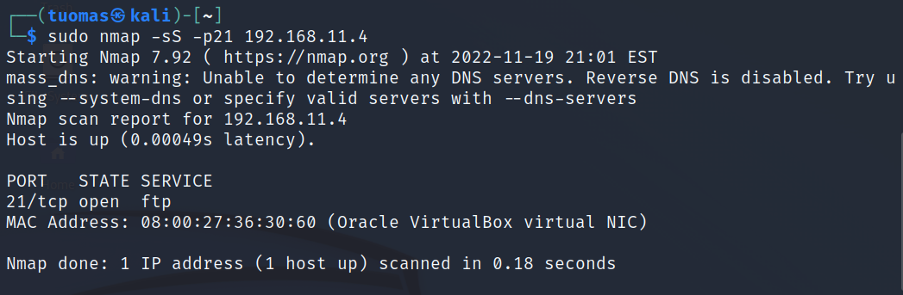

Wireshark logs showed packets relating to the scan on lines 5-7. In a TCP SYN scan Nmap sends a SYN packet (no. 5) to the target and gets back either an SYN/ACK (no. 6) if the port is open or a RST if the port is closed. On last row a closed connection is communicated by Nmap with a RST packet. 
 
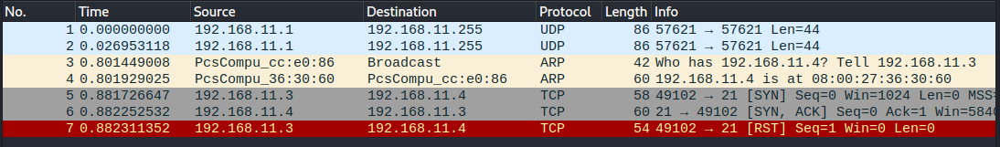

### c) nmap ping sweep -sn

I ran the following command:

    $ sudo nmap -sn 192.168.11.0/24

- -sn tells Nmap to run a ping sweep.
- 192.168.11.0/24 tells Nmap to scan IPs 192.168.11.1-255

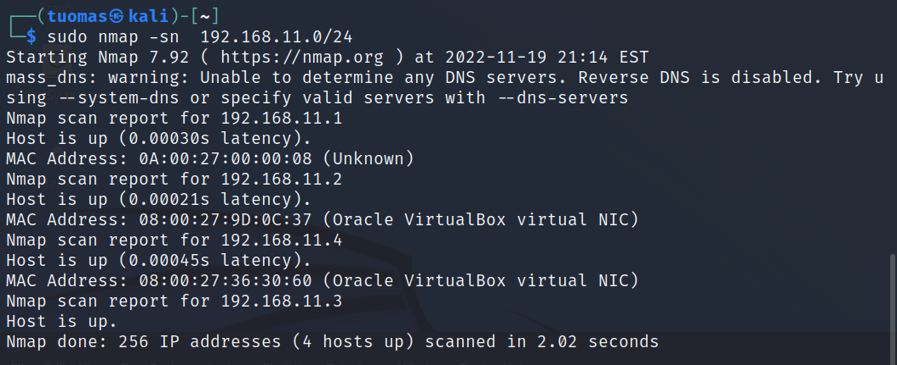

Nmap found four hosts on my network.

The Nmap documentation (`man nmap`) says that when a privileged user (sudo) does the ping sweep in a local ethernet network, Nmap sends ARP requests by default. This is what we can see in the Wireshark logs below.

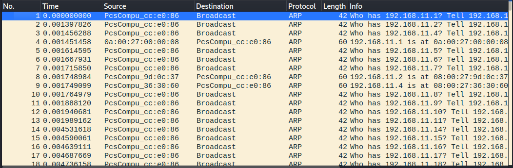

I wanted to try the normal ping sweep behavior, so I added the --send-ip flag and ran the command again.

    $ sudo nmap -sn --send-ip 192.168.11.0/24

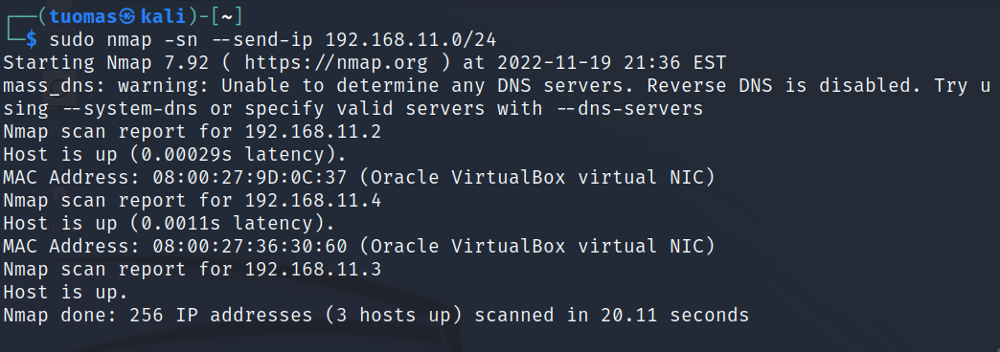

With this method the sweep didn't find 192.168.1.1. I'm not sure why.

The Wireshark log had about 3000 lines, so I filtered out the ARP packets. The Nmap ping sweep sends an ICMP echo request and a SYN packet to port 443 and an ACK packet and ICMP timestamp request to port 80. I'm not sure what ARP packets were or why there were so many of them. From the TCP and ICMP packet traffic we can see the SYN packets going to ports 443 and ACK packets going to ports 80. I don't know why there isn't any TCP or ICMP traffic to any of the IPs with no host in them.

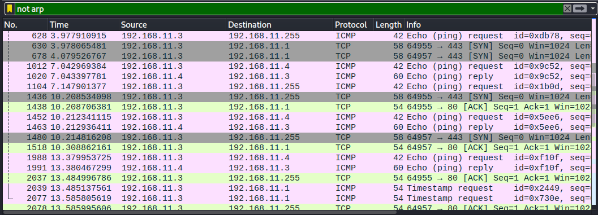

### d) nmap don't ping -Pn

I ran the following command:

    $ sudo nmap -sS -Pn --disable-arp-ping 192.168.11.1-7

- -sS tells Nmap to run a TCP SYN scan. It is the default scan but for clarity I added it here.
- -Pn tells Nmap to skip the host discovery phase completely and scan the ports on all IP addresses without checking if they are up or not.
- --disable-arp-ping tells Nmap not to send ARP request when scanning another host in the local ethernet network. I added this so I could simulate a more real-world example.
- 192.168.11.1-7 tells Nmap to only run the scan on these seven IP addresses.

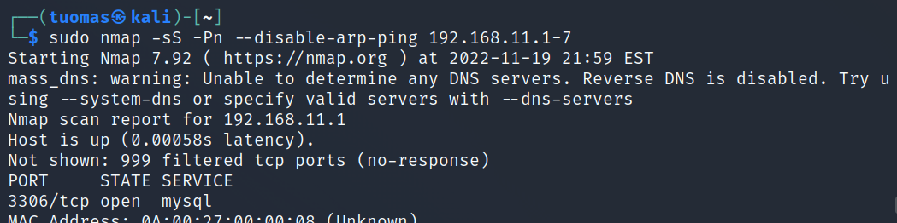
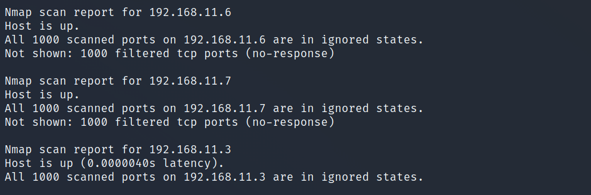

The output of the command shows that all seven addresses and all 1000 ports in each of them were scanned (Nmap defaults to the top 1000 most popular ports). It is weird that the scan shows hosts on IPs 5-7 to be up when I know that there is nothing there.

The wireshark log shows the usual SYN packets being sent and SYN/ACK being received as is the case with a TCP SYN scan.

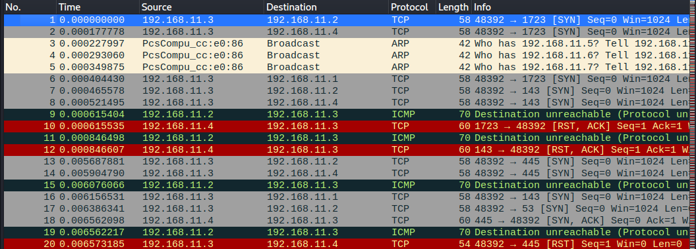

There is also a bunch of ICMP messages (type 3, destination unreachable). When this is sent back the port is marked as filtered by Nmap.

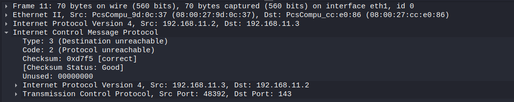

### e) nmap version detection -sV (example of one service in one port is enough)

I ran the following command:

    $ sudo nmap -sV -p21 192.168.11.4

- -sV tells Nmap to run a version detection scan.

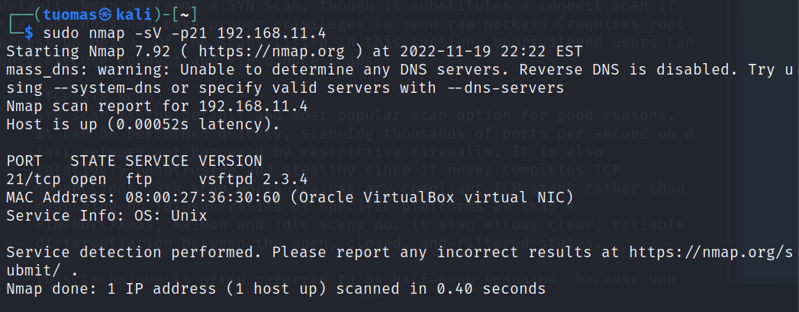

The output tells us that there is a FTP service listening to port 21/tcp. FTP stands for File Transfer Protocol. Additionally, the version detection tells us that the service is running on a Unix based operating system.

The Wireshark log shows that first Nmap does host discovery (no. 1 & 2). Then Nmap does a basic TCP SYN scan (no. 3-5). After that Nmap opens a new connection with SYN -> SYN/ACK -> ACK (no. 6-8). The target host then sends HTTP response 220 which is the sent in response to a new user connecting to a FTP server ([source](https://www.serv-u.com/resources/tutorial/214-215-220-221-ftp-response-codes)). 

After receiving the HTTP 220 response, Nmap sends an ACK packet to the target host. I'm not sure why this is done. Is it an acknowledgement of the HTTP response?

Then Nmap sends a FIN/ACK packet which would signal that the connection is closing ([source](https://ipwithease.com/what-is-tcp-fin-packet/)). To my understanding usually either the initiating or the receiving host first sends a FIN packet to which the other responds with FIN/ACK. I what the purpose of this packet is.

The target host responds with HTTP 500 sent over FTP protocol which indicates an internal server error. Nmap sends a RST packet to close the connection and the target host sends some FTP packet after which Nmap sends another RST packet.

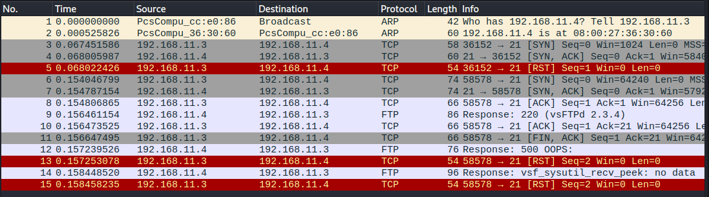

### f) nmap choosing ports: -p1-100, --top-ports 5, -p-

`-p1-100` scans ports 1-100 and `-p-` is a shorthand for -p1-65536, which scans all ports (except port 0). `--top-ports` is a bit more interesting because it scans the most popular ports and I wanted to find out what they were.

I ran the following command:

    $ sudo nmap -sS --top-ports 5 192.168.11.4

- --top-ports 5 tells Nmap to scan the five most popular ports

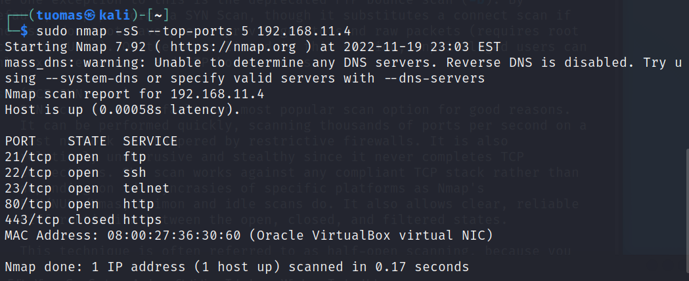

The five most popular ports according to Nmap are 21, 22, 23, 80, and 443. We can see that all but 443 are open.

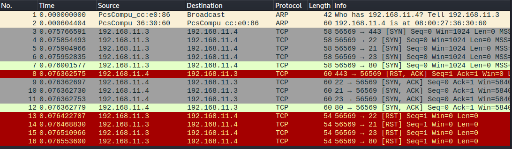

The Wireshark log shows host discovery (no. 1-2). After that we can see the TCP SYN scan by looking at the SYN and SYN/ACK packets. Port 443 (no. 8) responded with RST/ACK because it's not open. On lines 13-16 Nmap closes the connections with a RST packet.

### g) nmap choosing IP addresses; list, subnet mask 10.10.10.0/24, start-end 10.10.10.100-130 (use ipcalc to help calculate subnet mask)

Nmap IP addresses can be specified in multiple different ways. You can do a range like 192.168.11.0-255 or use a CIDR-style notation 192.168.11.4/24 which does the same thing.

I wanted to try getting IP addresses from a file. I created a file called *ip.txt* and listed three addresses on separate lines. I did a ping sweep with no host discovery so that I could see that all the IP addresses were scanned.

    $ sudo nmap -sn -Pn -iL ip.txt

- -iL tells Nmap to get the list of IP addresses from a file.

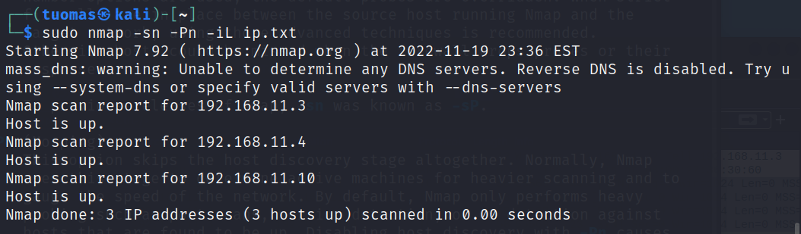

The command worked.

### h) nmap output files -oA foo. What do the files look like? What use cases do the different files have?

I ran the following command:

    $ sudo nmap -sV 192.168.11.4 -oA nmap-test

- -oA stores the scan results to three different files, normal, XML, and grepable format.

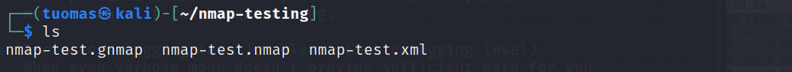

The normal format looks the same as the output that running the command gives. It has no special use case.

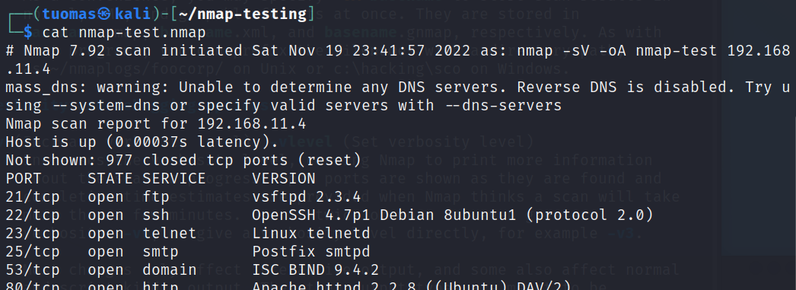

The grepable output is all on the same row. It is made to be the easily searchable with the grep command.

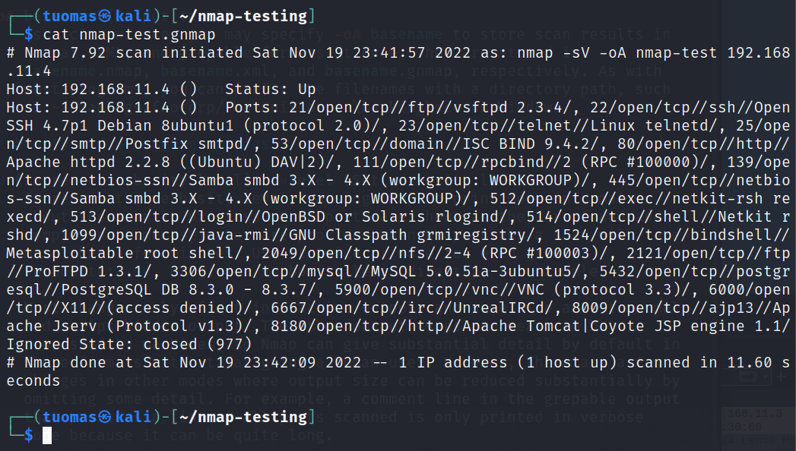

The XML output is in XML format. It is made to be utilized by web interfaces.

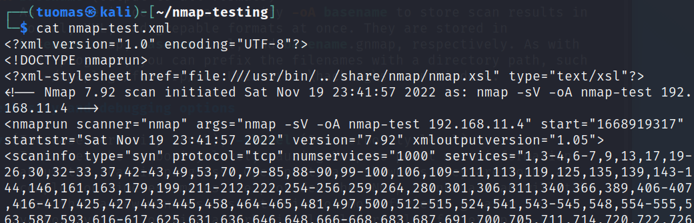

### k) nmap runtime interactions: verbosity v/V, help ?, packet tracing p/P, status s

I ran the following command and used the runtime interactions during it:

    $ sudo nmap -Pn -sV 192.168.11.4/24

First, I tried packet tracing p/P. It showed a lot of information about what sockets were doing what.

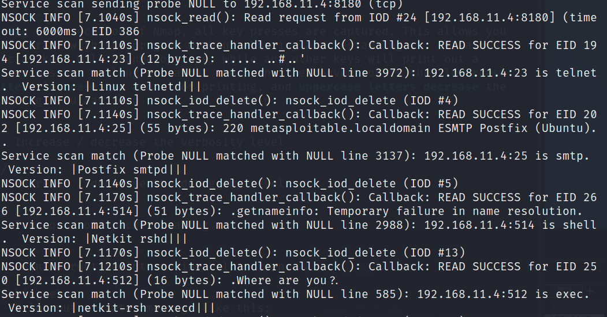

Increasing verbosity gave a bunch of information that was easy to understand

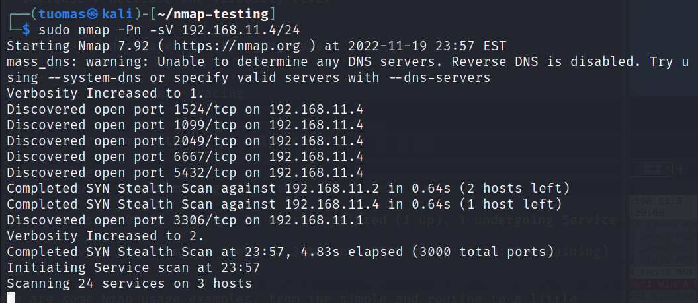

Debugging showed information that I couldn't really read too much into.

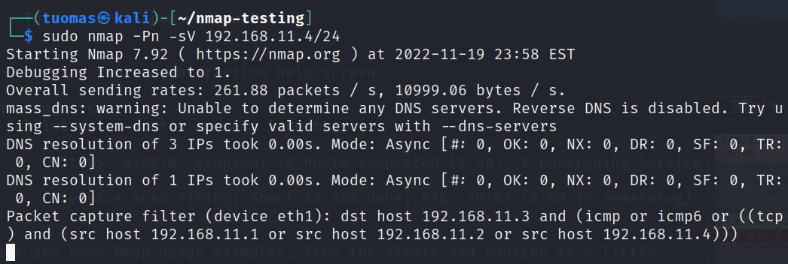

Finally, the status s gave two-line summary of the scan progress and current task.

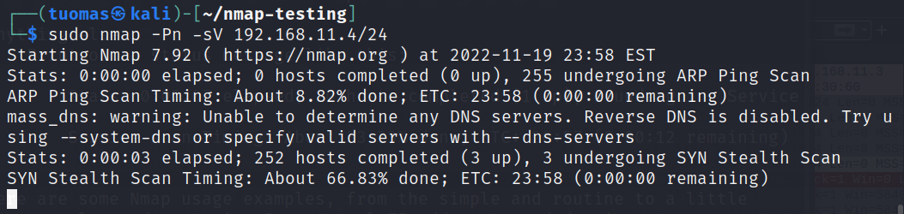

### l) Sudo nmap. How does nmap differ when ran with or without sudo?

According the Nmap manual, most port scans can't be run without administrator privileges because Nmap needs authority to send and receive raw packet data. The only scans that work are TCP connect scan and FTP bounce scan. I found that host discovery still works.

Port scan not working.

Ping sweep works.

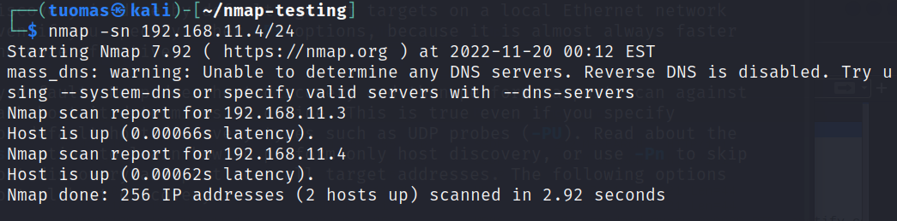

### m) nmap, compare the time difference between running nmap with -A and without it. Use a target machine with lots of open ports (e.g. Metasploitable 2). Compare sent data size if you know how to.

I ran the following command:

    $ sudo nmap -p- 192.168.11.4

A normal TCP SYN scan to all ports took about 15 seconds.

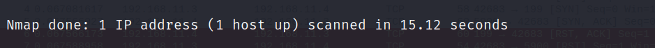

I ran a command with the `-A` flag:

    $ sudo nmap -A -p- 192.168.11.4

- -A tells Nmap to run `-O` OS detection, `-sV` version scanning, `-sC` script scanning, and `--traceroute` traceroute.

A scan with the -A flag took 180 seconds to complete.

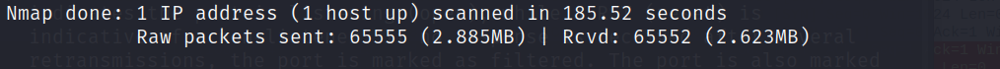

### Like ninjas. Install Apache and run a version scan against it. Does the scan show up on Apache logs?

--

---

## UDP scanning

### e) What are the most common or most interesting services that you could find with a UDP scan? (An answer with sources is sufficient, no test required)

Common UDP ports are 53 for Domain Name System (DNS), 67 and 68 for Dynamic Host Configuration Protocol (DHCP), and ports 161 and 162 for Simple Network Management Protocol (SNMP). One that I found interesting was that in order for your computer or gaming console to connect to the Xbox network UDP port 88 needs to be open (at least for the older consoles). ([source](https://www.lifewire.com/popular-tcp-and-udp-port-numbers-817985))

### f) Why is UDP scanning difficult and unreliable? Why should you use --reason flag when scanning UDP? (An answer with sources is sufficient, no test required)

The fact UDP doesn't require the host to send any acknowledgement means that classifying ports as open or closed becomes very unreliable. Sometimes the host might send back an UDP packet other times it might not. Because of this a lot of ports are marked as open|filtered meaning Nmap can't discern whether it's closed or just unresponsive but open. This is why using the --reason flag can be useful because it specifies the reason why a port has been classified as open|filtered.

Another difficulty with UDP scanning is the rate limits set by hosts to ICMP packets. UDP scanning relies on ICMP unreachable errors to mark ports as closed. Many host systems like Linux and Solaris set automatic limits to these packet rates to the tune of even 1 packet per second. This means that scanning 65535 ports would take around 18 hours.

Source: `man nmap`

## Nikto

**Objective: Install and try out nikto.**

Nikto is a web vulnerability scanner. Kali Linux comes with Nikto preinstalled. I did also try downloading the [Git repository](https://github.com/sullo/nikto) and testing the program that way.

I scanned Metasploitable 2 for vulnerabilities.

    $ nikto -h 192.168.11.4

- `-h` specifies the target host location.

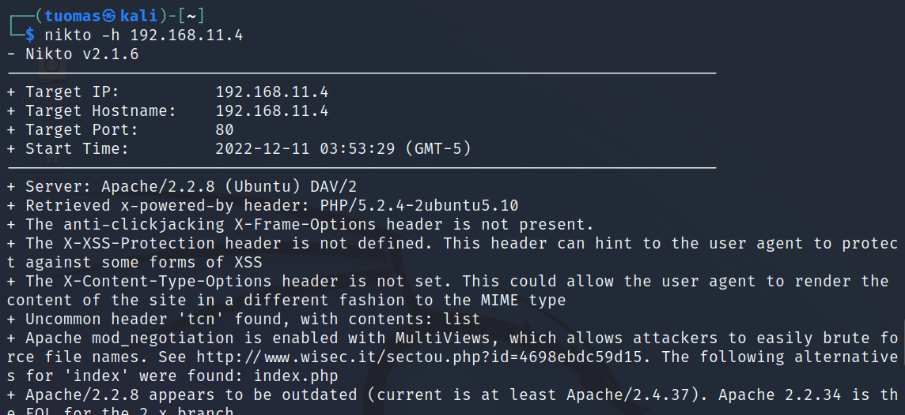

Nikto found several pages of interest such as /test/, /doc/, and a bunch of pages under /phpMyAdmin/. It also found potential vulnerabilities in the PHP and Apache configurations. 

## Sources

`man nmap`

StackExchange: https://networkengineering.stackexchange.com/questions/2012/why-do-i-see-a-rst-ack-packet-instead-of-a-rst-packet

Pico: https://www.pico.net/kb/what-is-a-tcp-reset-rst/

Serv-u: https://www.serv-u.com/resources/tutorial/214-215-220-221-ftp-response-codes

IPwithEase: https://ipwithease.com/what-is-tcp-fin-packet/

Lifewire: https://www.lifewire.com/popular-tcp-and-udp-port-numbers-817985

