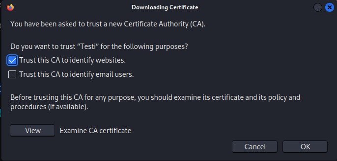
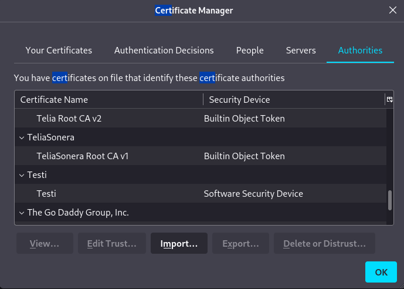
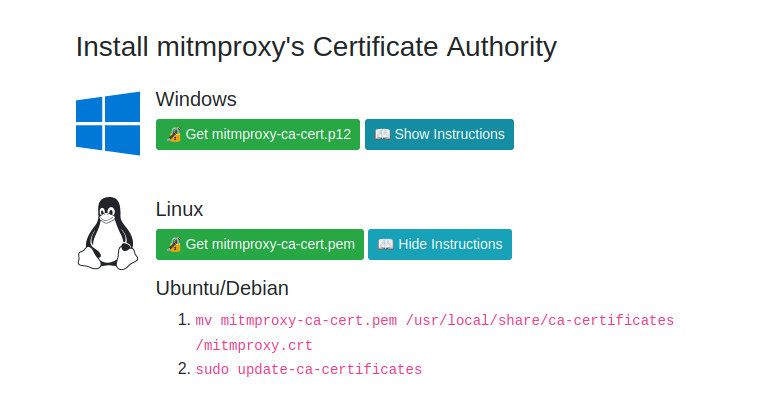

Course material: https://terokarvinen.com/2022/tunkeutumistestaus-ict4tn027-3010-syksylla-2022/

Environment: VirtualBox VM running Kali Linux. VM has 2 GB of RAM and 80 GB of disk space.

---

## Bellingcat OSINT

**Objective: Read and summarize a Bellingcat OSINT guide of your choosing.**

I read _[Bellingcat’s Invitation Is Waiting For Your Response: An Investigative Guide To LinkedIn ](https://www.bellingcat.com/resources/how-tos/2019/03/21/bellingcats-invitation-is-waiting-for-your-response-an-investigative-guide-to-linkedin/)_.

- Search for Linkedin profiles via the Linkedin search bar or using Google. Try using hidden search operators such as site:linkedin.com and double quotes (""). There work in Google but Linkedin also has its own hidden search operators.
- Use other tools that return contact information based on a Linkedin profile.
- Search the Linkedin profile photo in Yandex and Google reverse image search to find more profiles.
- Try looking at the Linkedin profiles endorsers' friends lists on other platforms such as Facebook to find profiles.

---

## OSINT Finland

**Objective: Many OSINT guides focus on a few bigger countries. Describe an OSINT source that is specific to Finland.**

Finnish companies have a lot of information public information about them. To find information, use sites like finder.fi which gathers information from ytj.fi, asiakastieto.fi, and fonecta.fi among others. In particular you can find out a companies board members and what other boards they sit on.

---

## OWASP ZAP

**Objective: Install OWASP ZAP. Browse the web and show that the traffic shows up in the proxy.**

### Install

**Written from memory since I already had ZAP installed:** I downloaded the Linux installer from [zaproxy.org](https://www.zaproxy.org/download/) and ran the installer with `bash`.

### Proxy

I launched ZAP from the Applications panel in Kali.

I selected to not store my session and clicked Start.

I clicked on Manual Explore in the Quick Start menu.

I set the URL to https://www.wikipedia.org and clicked Launch Browser.

The ZAP HUD start screen popped up. I clicked on Continue to target.

I clicked on the English wikipedia page and looked at the ZAP log. ZAP was logging hundreds of alerts relating to web vulnerabilities and a bunch of HTTP requests the page made. Below is a GET request the page made to a picture.

---

## ZAP certificate

**Objective: Intercept TLS encrypted traffic with ZAP.**

I followed [this guide](https://linuxconfig.org/how-to-generate-a-self-signed-ssl-certificate-on-linux) on how to create a self-signed TLS certificate.

I started by creating a directory called certs.

    $ cd /
    $ mkdir certs
    $ cd certs/

I created the private and public key for the certificate with `openssl`. Further explanations for the command parameters can be found in the source article.

    $ openssl req -newkey rsa:4096  -x509  -sha512  -days 365 -nodes -out certificate.pem -keyout privatekey.pem

I answered the questions the command required.

I returned to the ZAP proxy Firefox session and went to Settings and searched for Certificates. I clicked on View Certificates.

In the Certificate Manager on the Authorities tab I clicked on Import and selected the _certificate.pem_ file I had created.

In the popup I clicked on "Trust this CA to identify websites.".

I could now see my certificate listed.

Not sure if I should just use the ZAP certificate and set it so that it's trusted by the browser.

**Update 4.12.2022:**

I checked some of the other reports of this assignment (Github: [OskarBer](https://github.com/OskarBer/Tunkeutumistestaus/blob/main/H5/h5%20Kautta%20kiven%20ja%20kannon.md), [mansicka](https://github.com/mansicka/ICT4TN027-3010-tt-2022p2/tree/main/h5)). It seems like I had the OWASP Root CA certificate up and running the whole time. Because I launched Firefox from Manual Scan option in ZAP, in automatically added the OWASP certificate.

I viewed the site certificate in Firefox to make sure.

---

## Mitmproxy

**Objective: Install mitmproxy. Surf the web and show the traffic in the proxy.**

I already had mitmproxy preinstalled in Kali Linux.

I installed Foxyproxy extension to Firefox and configured it to send all traffic to localhost port 8081.

I ran mitmproxy on port 8081.

    $ mitmproxy -p 8081

I connected to a Metasploitable 2 VM I had running in the same network and a public HTTP site (source: [OskarBer](https://github.com/OskarBer/Tunkeutumistestaus/blob/main/H5/h5%20Kautta%20kiven%20ja%20kannon.md)). Mitmproxy logged the traffic.

---

## Mitmproxy TLS

**Objective: Intercept TLS-encrypted traffic with mitmproxy.**

I found mitmproxy's [documentation on certificates](https://docs.mitmproxy.org/stable/concepts-certificates/). With the proxy on I went to the address mitm.it in Firefox. There I found instructions on how to install the certificate.

After downloading the certificate, I navigated to my downloads directory, moved the certificate to under the /usr/ directory, and updated certificates.

    $ cd Downloads/
    $ mv mitmproxy-ca-cert.pem /usr/local/share/ca-certificates/mitmproxy.crt
    $ sudo update-ca-certificates

I imported the certificate to Firefox in Settings > Certificates. I tried browsing tuomasvalkamo.com and it worked. I double-checked that the certificate used was indeed mitmproxy. 

---

## Proxy WebGoat

**Objective: Solve a WebGoat lesson of your choice using a man-in-the-middle proxy like mitm or ZAP.**

I decided to solve A3 Sensivite Data Exposure. The goal of this lesson is to intercept traffic. A packet sniffer would be more suitable for this but a proxy does the job as well.

I opened up ZAP and clicked the Firefox button in the top right corner to open up Firefox with ZAP configured as proxy.

In ZAP, I clicked on the breakpoint button to stop all requests until I approve them.

In WebGoat, I clicked on the Log in button and the ZAP overlay HUD popped up with the HTTP request. I could see that the username was CaptainJack and the password was BlackPearl. If I wanted to I could've modified the parameters.

I entered the credentials to WebGoat and completed the lesson.

---

**Update 4.12.2022: Finished ZAP certificate assignment. Added Mitmproxy assignment.**

**Update 11.12.2022: Added mitmproxy TLS assignment. Added WebGoat assignment.**

## Sources

- Bellingcat: https://www.bellingcat.com/resources/how-tos/2019/03/21/bellingcats-invitation-is-waiting-for-your-response-an-investigative-guide-to-linkedin/
- Linuxconfig: https://linuxconfig.org/how-to-generate-a-self-signed-ssl-certificate-on-linux
- Linode: https://www.linode.com/docs/guides/create-a-self-signed-tls-certificate/
- OskarBer: https://github.com/OskarBer/Tunkeutumistestaus/blob/main/H5/h5%20Kautta%20kiven%20ja%20kannon.md
- mansicka: https://github.com/mansicka/ICT4TN027-3010-tt-2022p2/tree/main/h5
