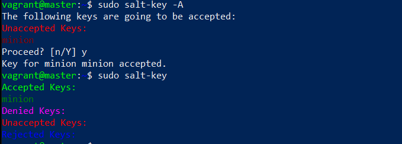

This post is a part of [Configuration Management Systems](https://terokarvinen.com/2022/palvelinten-hallinta-2022p2/) course at Haaga-Helia University of Applied Sciences.

Source code for this project is on [GitHub](https://github.com/tuomasvalkamo/starter-module).

---

## Introduction

Salt is an infrastructure management tool that can be used to control thousands of machines from a single system. Just describe what kind of state you want the machines to be in and Salt will install and configure everything.

In this post I will detail how I created [my own Salt module](https://github.com/tuomasvalkamo/starter-module). The project idea was to create a module that installs all the basic programs I would want on a new Virtual Machine. I can create a new Virtual Machine with, for example, [Vagrant](https://www.vagrantup.com/), throw the module on to it, and quickly get up and running. With this I can control multiple development machines from one place.

## Setting up the environment

With Vagrant, I created two Virtual Machines running Debian 11. One will act as the Salt master and the other as the Salt minion. Read more about creating Virtual Machines with Vagrant [here](https://tuomasvalkamo.com/CMS-course/week-6/). I'm using Windows 10 and PowerShell from which I will connect to the machines via SSH.

I connected to the master machine and installed the salt-master package.

    $ sudo apt-get update
    $ sudo apt-get install salt-master

I created the Salt directory under /srv/. This is the place where all Salt project files are located.

    $ sudo mkdir /srv/salt

I created a new directory called starter-module under /srv/salt. This will be the module's project directory. Inside the starter-module I created an init.sls file which will be the main place for the code.

    $ sudo mkdir starter-module
    $ sudo touch starter-module/init.sls

## Configuring the machine locally

Before running any Salt configurations to change the state of my minion machine, I will test everything locally on my master machine.

### Install and configure UFW

I started with installing UFW firewall.

    $ sudo apt-get install ufw


I added UFW install to the init.sls file.

```
ufw:
  pkg.installed
```

I then wanted to allow SSH and HTTP traffic through the firewall.

    $ sudo ufw allow 22/tcp
    $ sudo ufw allow 80/tcp

The `ufw allow` command added rules to the configuration files which are located under /etc/ufw.


I copied user.rules and user6.rules to /srv/salt/starter-module/ufw/. Although I could just run the `allow` commands through Salt to the minion machine, it is better to directly specify the state of the configuration files. This way any previous rules get overwritten, and I can have full confidence on what configurations are in place.

    $ sudo mkdir /srv/salt/starter-module/ufw
    $ cd /etc/ufw
    $ sudo cp user.rules user6.rules /srv/salt/starter-module/ufw

I added the UFW configurations to the Salt init.sls file.

```
# Allow 22/tcp and 80/tcp
/etc/ufw/user.rules:
  file.managed:
    - source: salt://starter-module/ufw/user.rules

/etc/ufw/user6.rules:
  file.managed:
    - source: salt://starter-module/ufw/user6.rules
```

On the first line I tell Salt the file I want to target. The third line with `source:` tells Salt what I want the target file to look like. The path salt:// means /srv/salt by default in Linux.

I enabled the firewall with `enable`.

    $ sudo ufw enable

I added the enable to init.sls

```
ufw enable:
  cmd.run
```

Salt minion uses root as the default user so `sudo` can be omitted from the command.

### Install and configure Micro

Micro is my preferred text editor.

I installed Micro.

    $ sudo apt-get install micro

I wanted to set it as the default editor for all users. This could be done by a script put in /etc/profile.d. I created a new script.

    $ sudoedit /etc/profile.d/editor-config.sh

Script content:

```
#! /usr/bin/bash

export EDITOR=micro
export SUDO_EDITOR=micro
```

I tested the script by exiting out of the SSH session and connecting back. This creates a new shell with the new configurations active. After connecting back, I opened the script with `sudoedit` and I was using Micro.


I created a new directory called micro to /srv/salt/starter-module/micro. Inside this I copied the editor-config.sh script.

    $ sudo cp editor-config.sh /srv/salt/starter-module/micro/

I added the script to init.sls

```
/etc/profile.d/editor-config.sh:
  file.managed:
    - source: salt://starter-module/micro/editor-config.sh
```

### Install and configure SSH server

SSH enables you to remotely connect to a machine.

Testing the SSH installation was impossible with my setup because Vagrant uses SSH to connect to the machine. I did all the previous steps over SSH.

I did try to simulate the actions anyway. I first installed the openssh-server package.

    $ sudo apt-get install openssh-server


I then ran `systemctl start`, but it didn't do anything because the service was already running. I checked the service status with `systemctl status`.

    $ sudo systemctl start ssh.service
    $ sudo systemctl status ssh.service


I added the install and service start to init.sls

```
openssh-server:
  pkg.installed

ssh:
  service.running
```

### Install Curl

Curl is a command line tool for transferring data with URL syntax.

I installed Curl.

    $ sudo apt-get install curl

I added Curl install to init.sls.

```
curl:
  pkg.installed
```

### Install and configure Apache

Apache is an open source web server.

I installed Apache.

    $ sudo apt-get install apache2

I checked the service status, and it was running automatically.

    $ sudo systemctl status apache2.service


I wanted to change the default Apache error page to a custom one. I edited the index.html file in /var/www/html.

    $ sudoedit /var/www/html/index.html

I set its content to be a [default HTML template](https://www.freecodecamp.org/news/html-starter-template-a-basic-html5-boilerplate-for-index-html/).

I checked localhost with Curl to make sure the changes worked.

    $ curl localhost


To add the new default page to the Salt configuration I created a new directory under starter-module called apache2. I copied the index.html file to there.

    $ sudo mkdir /srv/salt/starter-module/apache2
    $ sudo cp /var/www/html/index.html /srv/salt/starter-module/apache2/

I added Apache install and configuration to init.sls.

```
apache2:
  pkg.installed

# Replace Apache default page
/var/www/html/index.html:
  file.managed:
    - source: salt://starter-module/apache2/index.html
```

### Install Git

Git is a version control system.

I installed Git.

    $ sudo apt-get install git

I added Git install to init.sls.

```
git:
  pkg.installed
```

### Install Nmap

Nmap is a network scanner.

I installed Nmap.

    $ sudo apt-get install nmap

I added Nmap install to init.sls.

```
nmap:
  pkg.installed
```

### Install Netcat

Netcat is a networking utility.

I installed Netcat.

    $ sudo apt-get install netcat

I added Netcat install to init.sls.

```
netcat:
  pkg.installed
```

### Install Mitmproxy

Mitmproxy is a man-in-the-middle proxy.

I installed Mitmproxy.

    $ sudo apt-get install mitmproxy

I added Mitmproxy install to init.sls.

```
mitmproxy:
  pkg.installed
```

## Setting up the Salt minion

Now that I've tested all the functionality locally, it's time to apply the desired configuration to another machine. First, I need to connect the Salt minion to the master. I connected to my minion machine and installed salt-minion.

    $ sudo apt-get update
    $ sudo apt-get install salt-minion

I edited the minion configuration file. To the top of the file, I added the IP address for the master and a name for the minion machine, just to keep things organized.

    master: 192.168.22.10
    id: minion

I restarted the salt-minion service so that the changes take effect.

    $ sudo systemctl restart salt-minion.service

### Connecting minion to master

I switched over to the master machine. I made a change to the firewall rules to allow traffic on ports 4505 and 4506. These are the ports that the minions connect to to get instruction from the master. These are configurations that need to be done on the master machine, so they don't affect the module.

    $ sudo ufw allow 4505/tcp
    $ sudo ufw allow 4506/tcp

I listed all the keys with `salt-key`. I could see the minion in Unaccepted Keys.

    $ sudo salt-key


I accepted the minion.

    $ sudo salt-key -A



## Applying the Salt module to minion

In the master machine, I applied the module to the minion.

    $ sudo salt 'minion' state.apply starter-module

I got back a message that the minion did not return. There was also an "ERROR: Minions returned with non-zero exit code".


When I looked up the logs with `salt-run` it did seem to go through. Thirteen out of the fifteen tasks were completed. This was expected as the remaining two were the SSH server install and service startup.

    $ sudo salt-run jobs.lookup_jid 20221213153155082132


I checked the minion machine myself and everything did install correctly. I was also able to apply the Salt module to the minion again without the error. I checked the minion logs in /var/log/salt/minion and found nothing of interest. Google searches revealed similar problems and people either being confused by it or calling it a bug. I'll leave it at that.

## Conclusion

Working on this module gave me more confidence with Salt minions, modules and with infrastructure as code in general. A few months ago, I was just starting to learn how to use Linux and the command line. Now I can configure hundreds of machines the way I want to.

Check out the [source code](https://github.com/tuomasvalkamo/starter-module) for this project on my GitHub.

---

## Sources

- Tero Karvinen: https://terokarvinen.com/2022/palvelinten-hallinta-2022p2/
